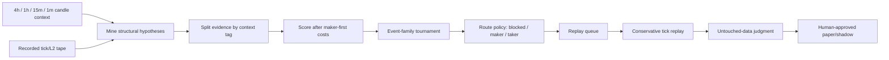

# Alpha Factory

The alpha factory is a research-only slow-loop component. Its job is to turn
recorded tick/L2 tape into structural hypotheses that deserve replay, not to
produce executable signals.

## Flow



Hard guards:

- `can_trade=false`
- `can_promote=false`
- raw hypotheses are not signals
- candle context tags are evidence splits, not trade permission
- conservative replay is mandatory
- untouched judgment and human approval remain mandatory

## Families

V1 mines five structural families:

- `forced_flow_continuation`
- `absorption_reversal`
- `microprice_dislocation`
- `liquidity_vacuum_continuation`
- `volatility_impulse`

These are intentionally broader than the old imbalance scanner. They search
for contexts professional scalpers care about: forced flow, absorption,
thin-book continuation, volatility impulse, and microprice dislocation. A
family only enters the replay queue if conditional expectancy clears the
maker-first cost floor and route policy.

## Event Scalper Tournament

The alpha factory now publishes `event_scalper_alpha_tournament_v1` under:

```text
alpha_factory.tournament
```

The tournament ranks active event families by exchange, symbol, and context
tag. It does not create new entries; it only ranks already-mined hypotheses by:

- replay state (`REPLAY_REQUIRED_TAKER`, `REPLAY_REQUIRED_MAKER`,
  `UNDER_SAMPLED`, `BELOW_COST`)
- route decision (`TAKER_ALLOWED`, `MAKER_ONLY`, `BLOCKED`)
- post-cost average net bps
- profit factor
- sample count
- route gap versus maker/taker breakeven

Tournament decisions:

- `REPLAY_TAKER_CANDIDATE`: taker route clears PF and net-bps floors, but
  conservative replay is still mandatory.
- `REPLAY_MAKER_CANDIDATE`: maker-first route clears PF and net-bps floors.
- `RECORD_MORE`: something fired, but sample count is not enough.
- `BLOCKED_FEE_WALL`: no replay priority; do not trade.

Every tournament row remains `can_trade=false` and `can_promote=false`.
The replay queue is a research queue only.

## Context Stack

The factory consumes the registered scalper context stack:

- `4h`
- `1h`
- `15m`
- `1m`

Each tick/L2 hypothesis is tagged as `aligned`, `mixed`, `hostile`, or
`missing` for the proposed side. This subjects context to the same mining
discipline as the microstructure families: it must improve conditional
expectancy after costs before it matters.

## Runtime

Continuous research publishes the payload under `alpha_factory` in
`research/live_research/latest.json`. Disable independently with:

```bash
ALPHA_FACTORY_ENABLED=0
```

Bound output rows with:

```bash
ALPHA_FACTORY_MAX_ROWS=50
```

Manual report:

```bash
python -m vnedge.research.alpha_factory --days 20260704
```

The factory shares the tick/L2 day selection used by scalper research and will
load available `4h/1h/15m/1m` candle Parquet datasets from the same data root.
It does not depend on scalper research being enabled.
