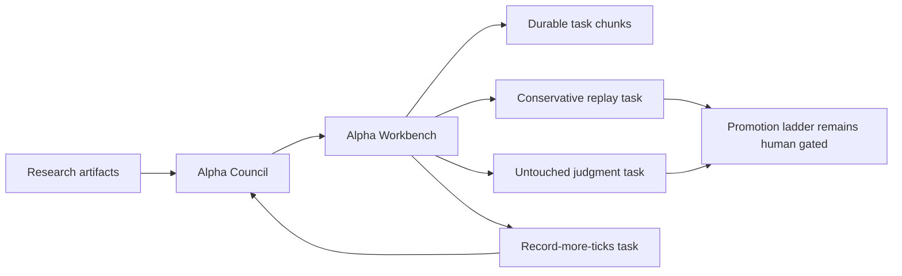

# Alpha Workbench

The Alpha Workbench is the durable proof-task queue between the agent council
and the research/scalper machinery.

The council answers: "what does this candidate need next?"

The workbench turns that answer into a restart-safe task:

- `RUN_CONSERVATIVE_L2_REPLAY` -> conservative replay task
- `PRE_REGISTER_UNTOUCHED_JUDGMENT` -> untouched judgment manifest task
- `RECORD_MORE_TICKS` -> data collection task

It writes:

- `research/live_research/alpha_workbench_latest.json`
- `research/live_research/alpha_workbench_feed.jsonl`
- `research/live_research/alpha_workbench/manifest.json`
- `research/live_research/alpha_workbench/chunks/*.json`

## Why It Exists

VNEDGE already has scanners, miners, alpha distillation, and an agent council.
The missing operational piece was memory. Without a durable backlog, the system
can keep debating the same promising lane without leaving a stable proof task
for replay, recording, or judgment.

The workbench solves that by assigning each task a stable ID from:

```text
next_action + candidate_id
```

If the same task appears again, the manifest updates `last_seen_at` and
`times_seen`, but the chunk is not duplicated or rewritten unless the task
content changes.

## Safety Contract

The workbench is research-only:

- `can_trade=false`
- `can_promote=false`
- `live_orders_enabled=false`
- no execution credentials
- no order adapter
- no parameter mutation
- no promotion decision

Every task remains blocked by the explicit proof gate it needs next, such as
`conservative_replay_result`, `human_approved_manifest`, or
`sample_size_and_coverage`.

## Run It

One-shot:

```bash
python -m vnedge.research.alpha_workbench --once --json
```

Loop:

```bash
python -m vnedge.research.alpha_workbench \
  --interval-seconds 900 \
  --max-tasks 50
```

Docker Compose service:

```bash
docker compose up -d --build alpha-workbench
```

## Flow


