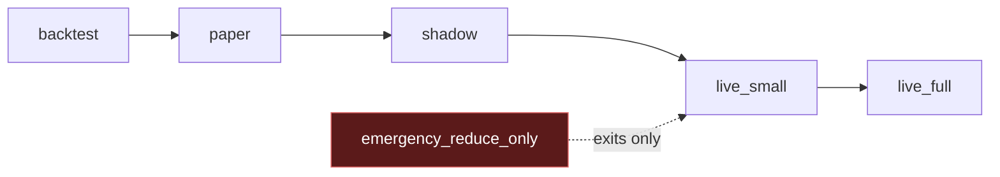
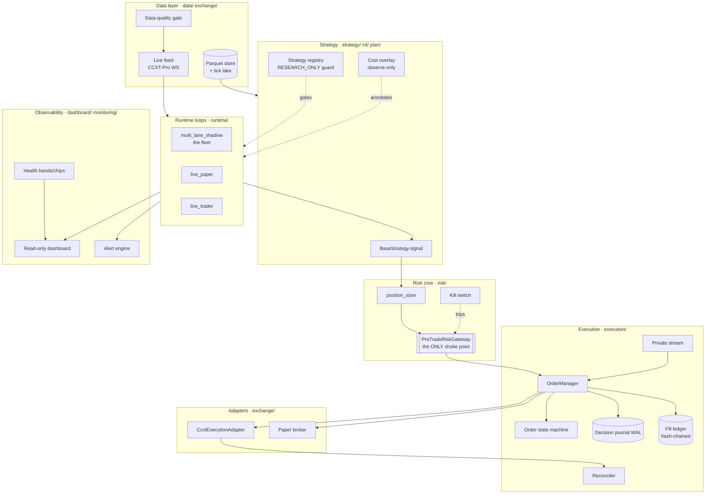
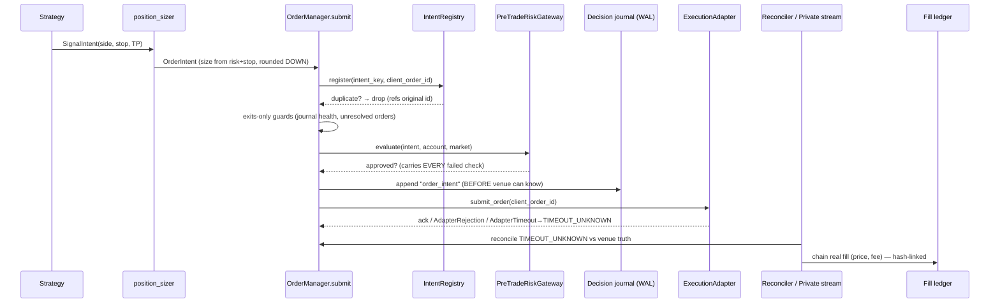

# VNEDGE — Architecture & Design Spec

**A crypto F&O / perpetuals trading system. Design axiom: capital protection beats profit, always.**
Nothing here is financial advice.

This document is the high-level design (HLD), the end-to-end implementation flow, a
code walkthrough, and the architecture spec. It reflects the code at the time of
writing (see `git log`); file:line references are anchors, verify against current source.

---

## 1. What VNEDGE is, in one screen

VNEDGE turns a market signal into a risk-checked order and back into a tamper-evident
record — with a hard rule that **every order passes one non-bypassable risk gateway**,
and that a strategy can only reach real money after surviving a disciplined, human-gated
promotion ladder on data it was never tuned on.

- **Capital design point:** < $1,000. Daily loss halt: `min(fixed USD default $20, % of peak equity)`.
- **Deployment:** single-process `asyncio` app, Linux VPS + Docker. Dev on macOS.
- **Exchanges:** Binance Futures (dev/validation), Delta Exchange India (first live candidate,
  native WS), Bybit (third, CCXT generic). Jurisdiction: India.
- **Nothing auto-promotes and nothing auto-trades.** Live requires three settings gates
  *plus* an adapter mainnet confirmation.

### The operating-mode ladder
The spine of the whole system. A strategy climbs one rung at a time; each rung is
validated before the next.



| Mode | Orders | Data | Purpose |
|---|---|---|---|
| `backtest` | simulated | historical | research / walk-forward judgment |
| `paper` | simulated fills | **live** | live-data validation, real risk layer |
| `shadow` | none (intents journaled) | **live** | gateway-evaluated, never a fill |
| `live_small` | **real**, capped | **live** | first real capital, `live_small_capital_cap_usd` |
| `live_full` | **real** | **live** | proven strategy only |
| `emergency_reduce_only` | reduce-only exits | live | flatten-only halt |

---

## 2. High-level architecture

Single-writer, single-process. The portfolio/risk state is naturally single-writer, so
there is no IPC, no event bus, no per-exchange process (explicitly rejected for v1). The
subsystems are Python packages under `src/vnedge/`.



**The one rule that shapes everything:** the only code path from an approved intent to a
venue is `OrderManager.submit()` → `PreTradeRiskGateway.evaluate()` → adapter. There is no
side door. `emergency_flatten`, `cancel_replace`, and the private stream all re-enter the
same pipeline or are reduce-only exits.

---

## 3. The execution pipeline (HLD + flow)

This is the heart of the system. One intent, one deterministic pipeline, every step
journaled *before* the next runs.



### Order state machine
`execution/order_state.py`. Transitions are whitelisted; anything else raises
`IllegalTransition`. The state that matters most is `TIMEOUT_UNKNOWN` — the order *may*
have reached the venue; it is never resolved by assumption, only by reconciliation.

```mermaid
stateDiagram-v2
    [*] --> SIGNAL_CREATED
    SIGNAL_CREATED --> RISK_REQUESTED
    RISK_REQUESTED --> RISK_APPROVED
    RISK_REQUESTED --> RISK_REJECTED
    RISK_APPROVED --> ORDER_INTENT_CREATED --> SUBMITTING
    SUBMITTING --> ACKNOWLEDGED
    SUBMITTING --> REJECTED
    SUBMITTING --> TIMEOUT_UNKNOWN
    ACKNOWLEDGED --> PARTIALLY_FILLED --> FILLED
    ACKNOWLEDGED --> FILLED
    TIMEOUT_UNKNOWN --> RECONCILING
    RECONCILING --> FILLED
    RECONCILING --> CANCELLED
    RECONCILING --> REJECTED
    RISK_REJECTED --> [*]
    FILLED --> [*]
    REJECTED --> [*]
    CANCELLED --> [*]
```

### Durability & crash recovery
- **Journal-before-submit:** the `order_intent` record (with the `client_order_id`) is
  written *before* the adapter call — after a crash you can always tell which orders
  might exist (`order_manager.py`, the `submit` pipeline).
- **Idempotency:** `client_order_id` minted once (uuid, never timestamp-derived), reused
  verbatim on retry inside the adapter. The `IntentRegistry` is seeded from the journal at
  startup (`_seed_registry_from_journal`) so a re-presented intent after a restart is
  dropped as a duplicate rather than double-booked.
- **Order rehydration:** on startup `_seed_orders_from_journal` restores any order whose
  last journaled lifecycle record is non-terminal (`order_intent` / `order_timeout_unknown`
  / `reconciling`) into `TIMEOUT_UNKNOWN`, so `has_unresolved_orders` blocks new risk until
  the reconciler confirms it. Resolved/acknowledged orders are skipped, so paper lanes
  (which ack synchronously) are never wedged.
- **Fail-closed reconciliation:** a settled position mismatch (venue truth ≠ internal
  model — including wrong-side or a shared-account position on another symbol) goes
  reduce-only and rebuilds internal state from the exchange; entries resume only after a
  clean pass.
- **Fill ledger:** `execution/fill_ledger.py`, append-only, fsync'd, hash-chained,
  resume-aware (refuses a broken tail). Paper fills and (via the private stream) live fills
  flow through the same ledger. Per-fill real economics (price, fee) come from the private
  `watch_my_trades` stream.

---

## 4. Risk & safety layer (`risk/`, `config/`)

The gateway is the single choke point; the settings/config layer is the frozen contract
around it.

- **Three live gates** (`config/settings.py` `is_live`): a `live_*` mode **AND**
  `live_trading_enabled=true` **AND** `confirm_live_trading == "I_UNDERSTAND_THIS_IS_HIGH_RISK"`
  (exact phrase). The adapter adds a fourth mainnet-construction gate (`live_confirmed`).
  No default-enabled live path.
- **PreTradeRiskGateway.evaluate** (`risk/risk_manager.py`): runs **every** check and
  returns all failed checks (rejections are fully explainable, not first-failure). Entry
  checks (kill switch, daily-loss halt, exposure caps, leverage, order type, freshness)
  live inside `if not intent.reduce_only:` — **reduce-only exits are never blocked** by
  entry quality, the kill switch, the daily-loss halt, or the reconciliation halt.
- **Position sizing** (`risk/position_sizer.py`): size = `risk_per_trade × equity ÷ stop_distance`,
  **never** from leverage; **rounds DOWN** to exchange steps; too-small results are
  **rejected** (never inflated to a minimum).
- **Leverage:** default 5x; `>10x` needs `acknowledge_high_leverage=true`; hard ceiling 30x
  (`ABSOLUTE_MAX_LEVERAGE`, a Field bound not overridable by config — changing it is a
  reviewed code change).
- **Daily-loss halt:** `min(fixed USD, % of peak equity)`; halts entries, not exits.
- **Kill switch** (`risk/kill_switch.py`): `touch KILL` trips it; a programmatic trip
  persists the KILL file so it survives restart; **never auto-resets** (reset requires the
  file removed + an operator note). It's exits-only in the gateway.
- **Frozen configs:** `RiskConfig`, `ProtectionConfig`, `DailySignalFactoryConfig`, `Settings`
  are pydantic `frozen=True` — limit changes require restart, not runtime mutation.
- **Pre-live checklist** (`runtime/pre_live_checklist.py`): fail-closed pre-flight; any
  critical red blocks; it **never enables anything**; requires the daily-loss halt ON and
  no fixed-margin sizing. A direct `LiveTraderSession` construction with a paper-style risk
  config is also refused (defense in depth).

---

## 5. Strategy & research → promotion pipeline

The anti-overfitting machine. The feature goal: **research cannot diverge from operations**,
and **nothing reaches capital without surviving untouched-data judgment through explicit
human-gated promotion.**

```mermaid
flowchart LR
    IDEA[strategy idea] --> BT[backtester<br/>decisions@close, fills@next-open]
    BT --> WF[walk-forward<br/>OOS-only, embargo, no compounding]
    WF --> GATE{promotion gates<br/>PF · payoff · DD · trades · concentration}
    GATE -- fail --> REJECT[rejected · do not tune on seen data]
    GATE -- pass --> PREREG[pre-registered judgment<br/>on UNTOUCHED data]
    PREREG --> HUMAN{{human approval}}
    HUMAN --> PAPER[paper trial] --> SHADOW --> LIVE_SMALL
```

- **Lookahead is structurally impossible** (`backtest/backtester.py`): the entry is
  *decided* at the close of bar `j` (`strategy.signal(df, j)` reads rows ≤ j) and *filled*
  at bar `j+1`'s open — the engine, not the strategy, enforces the gap. The ATR trail is
  applied *after* each bar's exit decision, so this bar's favorable extreme only tightens a
  *later* bar's stop (no intrabar rescue).
- **One sizing path:** backtest, paper, and live all size through `position_sizer.size_position`
  — they cannot disagree.
- **One exit engine:** `runtime/active_exit.py` (`ActiveExitState`) — stop / fee-aware
  breakeven / TP-ladder partials / ATR-chandelier trail / max-holding — is shared by
  backtest, paper, and live. Stop wins stop-vs-TP ties everywhere. This engine is now the
  backtester **default** so a promotion judgment runs the same exit the lane will deploy
  (a trail with the legacy exit is a config error, not a silent no-op).
- **Cost overlay is observe-only** (`plan/cost_model.py`, `plan_gate`): it records what a
  cost-aware plan *would* say for a decision bar; it never mutates the live decision and any
  error is swallowed. Fees/slippage default from shared constants so backtest and paper agree.
- **Walk-forward** (`backtest/walk_forward.py`): OOS-only judgment, min-trade-count
  selection, label-horizon embargo/purge, fresh equity per window (no compounding), an
  IS/OOS-collapse gate. Aggregate PF / payoff are computed from the exact per-window OOS
  trades.
- **Promotion discipline:** `RESEARCH_ONLY` families can't reach capital
  (`strategy/strategy_registry.py` `is_capital_eligible`; the governor forces a research-only
  strategy in PAPER back to SHADOW across the whole roster). Models trade **only** as a
  `BaseStrategy` through the gateway (`ml/ml_strategy.py`, threshold ≥ 0.5). `promotion.py`:
  *"No automatic promotion exists. Every upward move needs an explicit human call."*
- **The one intended divergence:** paper/live enforce the full risk layer (daily-loss halt,
  consecutive-loss breaker) the backtester does not model — so paper trades ≤ backtest trades.

---

## 6. Runtime loops (the fleet)

All runtime loops share the same closed-candle discipline and the same
`OrderManager`→gateway pipeline; they differ only in the adapter and whether they place
real orders.

- **`multi_lane_shadow.py`** — the production fleet. Builds N lanes (each a
  `live_paper.LivePaperSession`) across exchanges × symbols × fill-modes (paper = simulated
  fills on live data; shadow = gateway-evaluated intents, no fill). `MultiLaneProvider.latest()`
  coalesces every lane's snapshot and annotates health for the dashboard. A **governor**
  prunes the roster to the human-approved set.
- **`live_paper.py`** — one lane. Full entry hygiene before an entry: the candle-path
  **arm-gate** (Time Machine health/age), the **protections** breaker (post-stop cooldown /
  stop-window), and the **daily-factory** windows (session cutoff, per-day cap). Exits bypass
  all of them. Records observe-only regime + cost-plan overlays.
- **`live_trader.py`** — one lane, **real orders**. The paper session's counterpart: the
  same arm-gate/protections/daily-factory (L3), the same shared exit engine (A1), real
  venue equity/drawdown (L1), fill-ledger chaining (L1-inc2/3), fail-closed reconciliation
  with rebuild-from-venue (L4). The per-bar loop body is exception-contained so a bar fault
  never terminates the real-money loop.
- **`live_trader_main.py`** — the ONLY runtime that can run `live_trader` against a real
  venue. It is a fail-closed gate chain: three live gates → pre-live checklist → credentials
  → only then wire the adapter, account provider, feed, order manager, reconciler, fill
  ledger, and private stream, and run.
- **Time Machine** (`data/time_machine.py`) — forming + closed multi-timeframe view with
  gap/stall/future guards; feeds the arm-gate. A Time Machine fault is fail-safe: it marks
  itself degraded (which the arm-gate reads as a block) and never wedges a healthy lane.

---

## 7. Data & adapters

- **Ingestion** (`data/`): CCXT candle / funding / open-interest → Parquet store, with a
  **data-quality gate** at the boundary (sequence / staleness / clock-skew).
- **Live feed** (`exchange/live_feed.py`): CCXT-Pro websockets, closed-candle discipline,
  order-book-top quotes; honest staleness = wall-clock since the last WS event, so the
  gateway's freshness check works for real.
- **Tick lake** (`exchange/tick_recorder.py`, `data/aggtrades_backfill.py`): zero-risk
  recorder for trades + L2 book, plus Binance Vision aggTrades backfill — the substrate for
  microstructure research.
- **Execution adapters** (`exchange/`): `CcxtExecutionAdapter` (mainnet, `live_confirmed`
  gate, same `client_order_id` on retry), the paper broker (idempotent simulated venue,
  pessimistic fills), and Delta India's native WS client (CCXT has no Delta WS).

---

## 8. Observability (`dashboard/`, `monitoring/`)

- **Read-only dashboard** (`dashboard/app.py`): a FastAPI app whose data routes are all
  `GET` + a bearer-token session mint + a read-only snapshot WebSocket. **No route mutates
  trading state** — it cannot place/cancel an order, flip a gate, reset the kill switch, or
  change config. Per-lane side endpoints reject `?lane=<orphan>` so a config leftover can't
  masquerade as a live lane.
- **Single-sourced health** (`dashboard/health_bands.py` + `runtime/latency_thresholds.py`):
  the five safe-to-arm chips (SYSTEM / FEED / CANDLE / DECISION / RISK) and per-lane bands
  are computed **server-side** from the canonical thresholds; both cockpits (classic
  `index.html` and React `/app`) render the same values. `UNKNOWN` never fakes `OK` at the
  arm-gate.
- **lane_health** (`runtime/lane_health.py`): cross-checks desired-vs-active lanes on disk
  (OK / STALE / SILENT / MISSING / ORPHAN / SHADOW_PROBATION); non-OK lanes can never look
  trade-ready. Surfaced in both cockpits.
- **Alerts** (`monitoring/`): severity + cooldown, journal-first (`alerts.jsonl`), guarded
  notifiers (Telegram), wired into trial sessions.

---

## 9. End-to-end code walkthrough — trace one live entry

1. **Feed** delivers a closed candle → `live_trader.run()` appends it and feeds the Time
   Machine (`_feed_time_machine`).
2. **Exits first** — `_manage_exit` routes the bar through the shared `ActiveExitState`
   (`resolve_bar`); any stop/breakeven/TP/trail/max-holding decision submits a full-position
   reduce-only close. Exits run before, and independent of, all entry gates.
3. **Entry hygiene** — if flat + allowed + nothing unresolved + the private stream is fresh:
   `_entry_hygiene_block` runs the arm-gate → protections → daily-factory. A block is
   counted + logged and the bar produces no entry.
4. **Signal** — `strategy.prepare()` then `strategy.signal(df, idx)` → a `SignalIntent`.
5. **Size** — `_submit_entry` reads venue account truth, checks the capital cap, and sizes
   via `position_sizer.size_position` (rounds down; too-small → skip).
6. **Submit** — builds the `OrderIntent`, mints the deterministic `intent_key`, and calls
   `OrderManager.submit`: duplicate guard → exits-only guards → **`gateway.evaluate`** →
   journal `order_intent` → `adapter.submit_order` → ack / reject / `TIMEOUT_UNKNOWN`.
7. **Reconcile & chain** — the reconciler resolves any `TIMEOUT_UNKNOWN` against venue truth;
   the private stream applies real fills into the `OrderManager` and chains them into the
   fill ledger with true price/fee; `_reconcile_positions` fails closed on any divergence.
8. **Report** — `_report()` emits real venue equity / peak-drawdown / net-since-start and
   the chained fill count.

Every arrow above is journaled, and the only way from step 5 to a venue is through step 6's
gateway.

---

## 10. Invariants (and where they live)

| Invariant | Enforced in |
|---|---|
| Every order passes the risk gateway — no bypass | `execution/order_manager.py` (single `submit`→`evaluate`→adapter path) |
| Three live gates + exact phrase; no default-live | `config/settings.py` `is_live`; `runtime/live_trader*.py` construction gates |
| Reduce-only exits never blocked | `risk/risk_manager.py` (`if not intent.reduce_only:`) |
| Sizing from risk/stop, rounds down, too-small rejected | `risk/position_sizer.py` |
| Leverage ≤ 30x hard bound; >10x acknowledged | `config/risk_config.py` (Field bound + validator) |
| Idempotency: mint once, journal, reuse; seeded on restart | `execution/idempotency.py`, `order_manager.py` |
| Journal-before-submit; journal-unavailable ⇒ exits only | `execution/order_manager.py`, `journal.py` |
| TIMEOUT_UNKNOWN blocks new risk; mismatch ⇒ fail closed + rebuild | `execution/order_manager.py`, `runtime/live_trader.py` |
| Kill switch: file-based, no auto-reset, programmatic trip persists | `risk/kill_switch.py` |
| Frozen risk configs | `config/risk_config.py`, `settings.py` (`frozen=True`) |
| Lookahead structurally impossible; shared sizing + exit engine | `backtest/backtester.py`, `runtime/active_exit.py` |
| Nothing auto-promotes; research-only can't reach capital | `runtime/promotion.py`, `strategy/strategy_registry.py` |
| Dashboard is read-only | `dashboard/app.py` (no mutating routes) |

---

## 11. Deployment topology

- **Docker on a Linux VPS** (`Dockerfile`, `docker-compose.yml`, `docs/DEPLOY.md`). The
  image has an isolated Node build stage for the React SPA; the final image is Python-only.
- **Running services** (production VM): `multi-lane-shadow` (the fleet + the dashboard on an
  in-container port), a Caddy TLS proxy exposing the dashboard, and an ML-pipeline-status
  sidecar. The many `research/*` loops are defined but run on demand.
- **Secrets:** trade-only API keys via env / `.env` (gitignored); a load-bearing governor
  override (`MULTI_LANE_GOVERNOR_PAPER_ROSTER_ONLY`) lets the human hard-cut the roster.
- **Kill switch:** `touch KILL` in the working directory; the pre-live checklist and the
  gateway both read `KILL_FILE`.

---

## 12. Deliberately rejected for v1 (revisit only with evidence)

UDS risk daemons, NATS/Redpanda event bus, per-exchange processes, CPU pinning, ONNX C-API
hot paths, sub-3ms latency targets (network RTT to the exchange is 10–100ms; strategies live
at seconds-to-hours), options trading. See the 2026-07-02 architecture review in `CLAUDE.md`.

---

*Implementation contracts for the data-quality gate, order state machine (incl.
TIMEOUT_UNKNOWN handling), reconciliation scope, and WAL rules live in `docs/DESIGN.md`.
This document is the map; DESIGN.md is the contract; the code is the truth.*
