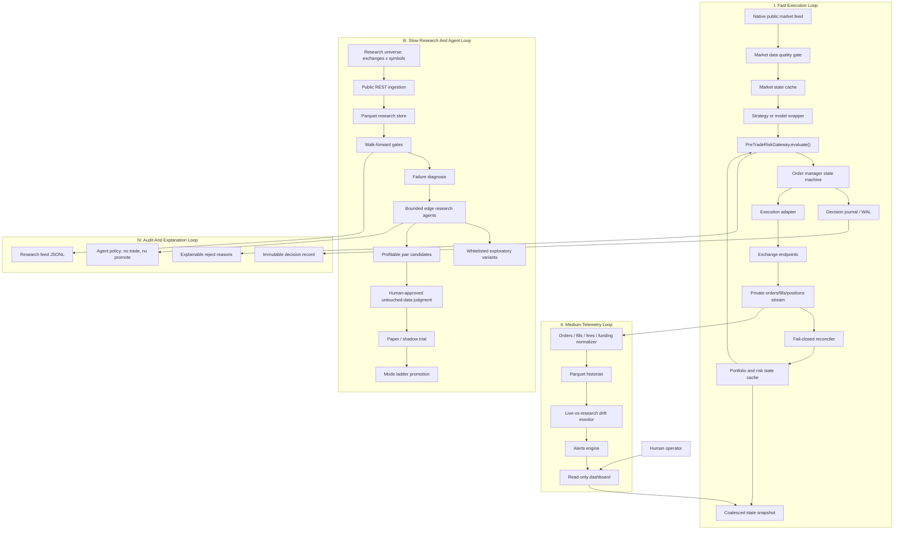
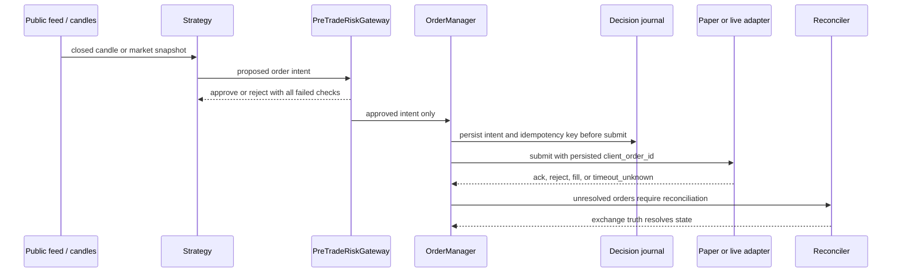
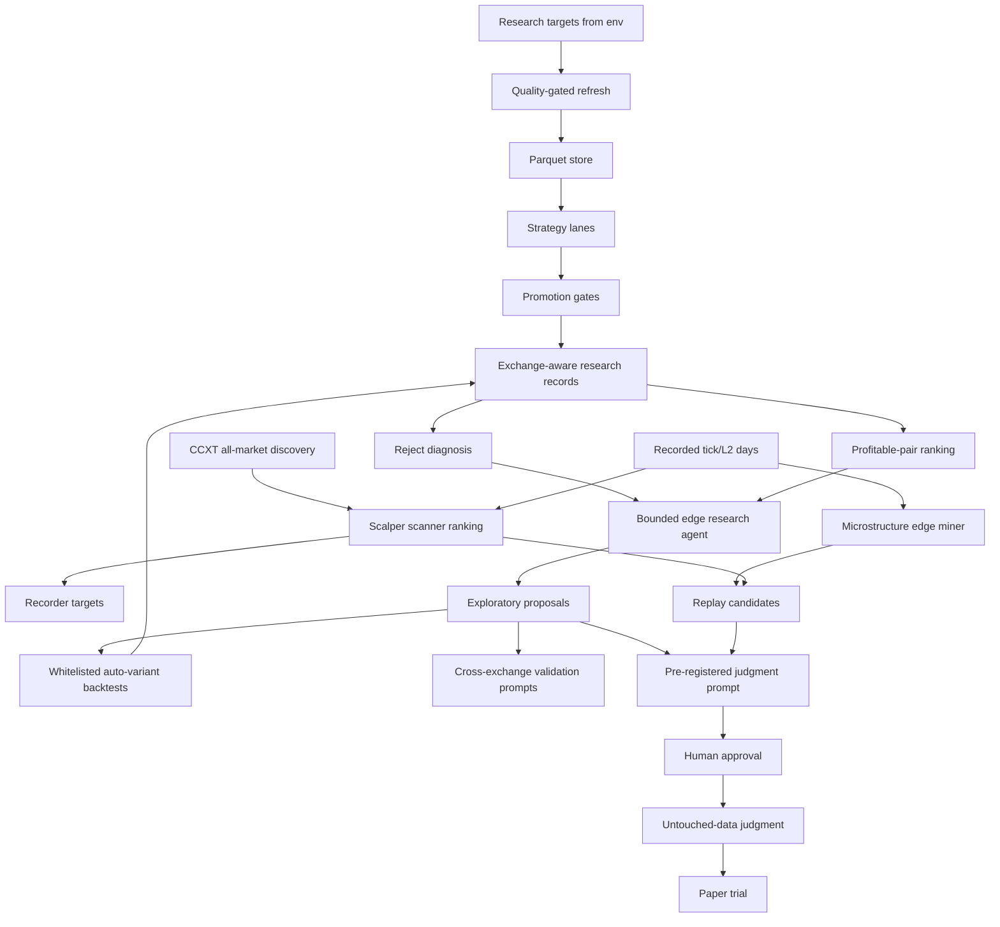
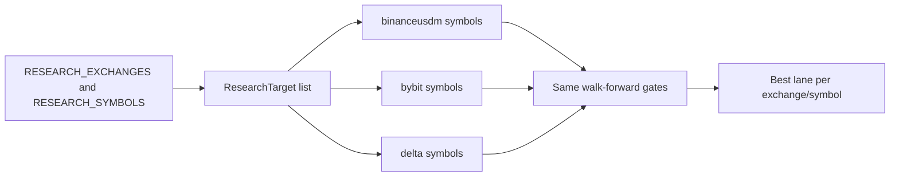
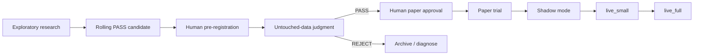

# VNEDGE Architecture Flow

Status date: 2026-07-04.

This document maps the current VNEDGE system to the target scalper/research
vision. The core rule is unchanged: every execution order must pass
`PreTradeRiskGateway.evaluate()`, live trading remains behind the three live
gates, and AI/research agents never trade or promote strategies directly.

## Status Legend

| Status | Meaning |
|---|---|
| Current | Implemented on the main V1 path. |
| Branch | Implemented in an open feature branch/PR. |
| Next | Required next architecture work. |
| Deferred | Deliberately post-V1 until there is evidence of need. |

## Top-Level Flow



## Current Execution Path



Execution invariants:

- No order path bypasses the gateway.
- Journal failure means no new risk-increasing entries.
- `TIMEOUT_UNKNOWN` blocks new risk until reconciliation resolves it.
- Reconciliation mismatch fails closed: entries stop, reduce-only remains.
- Kill switch never auto-resets.

## Scalper Target Flow

This is the practical scalper path that matches the vision without pretending
sub-3ms colocated execution exists in V1.

```mermaid
flowchart LR
    Trades["Streaming trades"] --> Micro["Microstructure state"]
    L2["L2 book builder"] --> Micro
    AllMarkets["All active linear perp/future markets"] --> Scanner["Scalper scanners\n(liquidity / flow / PF / route cost)"]
    Scanner --> Recorder["Tick/L2 recorder priorities"]
    Recorder --> Miner["Edge miner\n(pressure / absorption / microprice)"]
    Miner --> Scanner
    Recorder --> L2
    Private["Private fill/order stream"] --> Truth["Exchange truth cache"]
    Micro --> Features["Incremental feature engine"]
    Features --> Scalper["Scalper strategy interface"]
    Scalper --> ScalpRisk["Scalper risk overlay"]
    ScalpRisk --> Gateway["PreTradeRiskGateway.evaluate()"]
    Gateway --> Router["Order manager / hot router"]
    Router --> Exchange["Exchange"]
    Exchange --> Private
    Truth --> Reconcile["Fail-closed reconciliation"]
    Reconcile --> Gateway
    Truth --> Stops["Tick-level reduce-only stop engine"]
    Stops --> Gateway
```



Scalper-specific checks:

- Book/trade freshness.
- Spread and depth sanity.
- Edge after fees and slippage.
- Order-rate and cancel-rate limits.
- Private stream freshness.
- Reduce-only exits not blocked by entry-quality checks.
- Scanner approval is research-only; it never bypasses replay, paper, or the
  gateway.
- Maker/taker route is blocked unless replay PF and avg net bps clear the
  breakeven floor.

## Research Agent Flow



Research-agent guardrails:

- Agents can propose, rank, and explain only.
- Agents cannot trade, promote, change live config, or tune a running trial.
- Variant proposals come from the fixed diagnostics catalog.
- A rolling PASS is still only a candidate.
- Paper promotion requires human approval and untouched-data judgment.

## Exchange And Pair Coverage

The research loop can sweep multiple venues while execution V1 remains
single-exchange.



Default research universe:

- Exchanges: `binanceusdm`, `bybit`, `delta`.
- Symbols: `BTC/USDT:USDT`, `ETH/USDT:USDT`, `SOL/USDT:USDT`,
  `BNB/USDT:USDT`, `XRP/USDT:USDT`, `DOGE/USDT:USDT`.
- Timeframe: `1h`.

Runtime knobs:

```bash
RESEARCH_EXCHANGES=binanceusdm,bybit,delta
RESEARCH_SYMBOLS=BTC/USDT:USDT,ETH/USDT:USDT,SOL/USDT:USDT
RESEARCH_SYMBOLS_BYBIT=BTC/USDT:USDT,SOL/USDT:USDT
RESEARCH_TIMEFRAME=1h
```

## Status Map

| Block | Status | Notes |
|---|---|---|
| Config, risk core, live gates | Current | Hard caps and live confirmation gates exist. |
| Candle/funding/OI ingestion | Current | Quality-gated public data ingestion. |
| Backtester and walk-forward gates | Current | OOS-only judgment, sparse/offensive gates. |
| Strategy registry and current lanes | Current | Funding MR, trend, offensive lanes. |
| Order manager, idempotency, WAL | Current | Timeout and reconciliation semantics exist. |
| Paper/shadow runner | Current | Uses same gateway/order manager path. |
| Dashboard read-only snapshot | Current | No control routes. |
| Multi-exchange research universe | Branch | Offline research only; execution remains V1 scoped. |
| Bounded edge research agents | Branch | Propose/rank/explain only. |
| Control-room dashboard cockpit | Branch | Visual architecture/status surface. |
| Scalper microstructure foundation | Branch | In-process features/risk/tick-stop foundation. |
| Scalper scanners and edge miner | Branch | Discover all derivative pairs; rank lanes by liquidity, PF, route cost, fill evidence, sample sufficiency, and microstructure hypothesis expectancy. |
| Live Binance testnet execution | Next | Required before any live mode. |
| Private stream reconciliation | Next | Source of truth for orders/fills/positions. |
| L2 order book builder | Current | Recorder writes L2 shards with L1 aliases for replay. |
| Tick-level stop monitoring | Next | Reduce-only exits through gateway. |
| Delta/Bybit live adapters | Next | After one venue is proven. |
| TimescaleDB historian | Deferred | Parquet is enough for V1. |
| NATS/shared-memory IPC | Deferred | Single-process V1 remains simpler and safer. |
| ONNX C-API hot path | Deferred | Only after model edge and latency need are proven. |
| Sub-3ms execution target | Deferred | Network RTT dominates this VPS-style system. |

## Promotion Flow



No branch in this flow is automatic. Every promotion step is gated by evidence,
human approval, and the execution safety layer.
