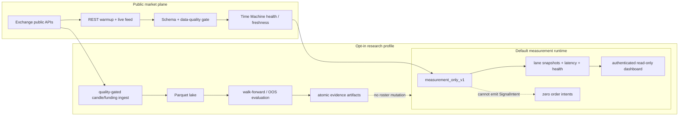
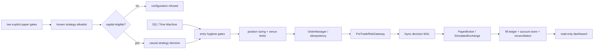
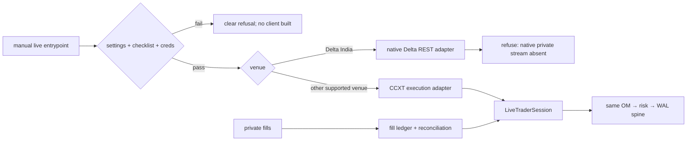

# VNEDGE Architecture Flow

Status after the scanner removal refactor: measurement and safety are the
default product. The capital roster is empty unless an operator supplies both
paper-capital gates and names a registered, capital-eligible strategy. There is
no default live Compose service.

## System boundary

```mermaid
flowchart LR
    subgraph Public["Public market plane"]
        Venue["Exchange public APIs"] --> Feed["REST warmup + live feed"]
        Feed --> DQ["Schema + data-quality gate"]
        DQ --> TM["Time Machine health / freshness"]
    end

    subgraph Default["Default measurement runtime"]
        TM --> Measure["measurement_only_v1"]
        Measure --> Snapshot["lane snapshots + latency + health"]
        Snapshot --> Dashboard["authenticated read-only dashboard"]
        Measure -. "cannot emit SignalIntent" .-> NoOrders["zero order intents"]
    end

    subgraph Research["Opt-in research profile"]
        Venue --> Ingest["quality-gated candle/funding ingest"]
        Ingest --> Lake["Parquet lake"]
        Lake --> WF["walk-forward / OOS evaluation"]
        WF --> Evidence["atomic evidence artifacts"]
        Evidence -. "no roster mutation" .-> Default
    end
```

## Optional paper-capital flow

Paper capital is disabled by default. It requires:

1. `MULTI_LANE_CAPITAL_ENABLED=1`;
2. a non-empty `MULTI_LANE_CAPITAL_STRATEGY`;
3. the ID to exist in the small registry; and
4. `is_capital_eligible(id)` to pass (unknown, measurement-only, and killed IDs
   fail closed).

```mermaid
flowchart LR
    Config["two explicit paper gates"] --> Registry["known strategy allowlist"]
    Registry --> Eligible{"capital eligible?"}
    Eligible -- "no" --> Refuse["configuration refused"]
    Eligible -- "yes" --> Strategy["causal strategy decision"]
    TM["DQ / Time Machine"] --> Gates["entry hygiene gates"]
    Strategy --> Gates
    Gates --> Size["position sizing + venue limits"]
    Size --> OM["OrderManager / idempotency"]
    OM --> Risk["PreTradeRiskGateway"]
    Risk --> WAL["fsync decision WAL"]
    WAL --> Sim["PaperBroker / SimulatedExchange"]
    Sim --> Ledger["fill ledger + account store + reconciliation"]
    Ledger --> Dashboard["read-only dashboard"]
```

Every exit stays reduce-only and follows the same gateway, WAL, and order
manager. A WAL recovery fault, venue-position read error, Time Machine error,
or unresolved order blocks new risk without blocking exits.

## Guarded live entrypoint (not deployed)

`vnedge.runtime.live_trader_main` remains a guarded experiment, not a service.
It constructs no network client until the three live settings gates, pre-live
checklist, and credentials pass. Binance/Bybit use the CCXT execution adapter.
Delta India dispatches to the native Delta REST adapter, but live Delta startup
still refuses because a native private order/fill stream is not implemented.

```mermaid
flowchart LR
    CLI["manual live entrypoint"] --> LiveGates{"settings + checklist + creds"}
    LiveGates -- "fail" --> Stop["clear refusal; no client built"]
    LiveGates -- "pass" --> Dispatch{"venue"}
    Dispatch -- "Delta India" --> Delta["native Delta REST adapter"]
    Delta --> PrivateMissing["refuse: native private stream absent"]
    Dispatch -- "other supported venue" --> CCXT["CCXT execution adapter"]
    CCXT --> Session["LiveTraderSession"]
    Session --> OM2["same OM → risk → WAL spine"]
    Fills["private fills"] --> Recon["fill ledger + reconciliation"]
    Recon --> Session
```

## Deployable services

| Service | Default | Authority |
|---|---:|---|
| `multi-lane-shadow` | yes | Public data, observation snapshots; paper only when explicitly gated |
| `research-loop` | research profile | Public ingest and offline evidence; no orders or promotion |
| `dashboard-tls` | yes | TLS proxy for authenticated read-only dashboard |

There are no scanner, Pine, alpha-uplift, automatic manifest, or live-order
services in Compose.

## Durable safety state

- The decision WAL keeps its valid prefix, quarantines a malformed tail, and
  latches `recovery_degraded` until reconciliation/operator acknowledgement.
- Position reads return explicit success/error state; an API exception is never
  interpreted as a flat account.
- Order intents reject invalid symbol, side, size, notional, leverage, and TIF
  at construction.
- Time Machine health/age exceptions return `tm_error` and block new entries.
- Unknown strategy IDs are not capital eligible.
