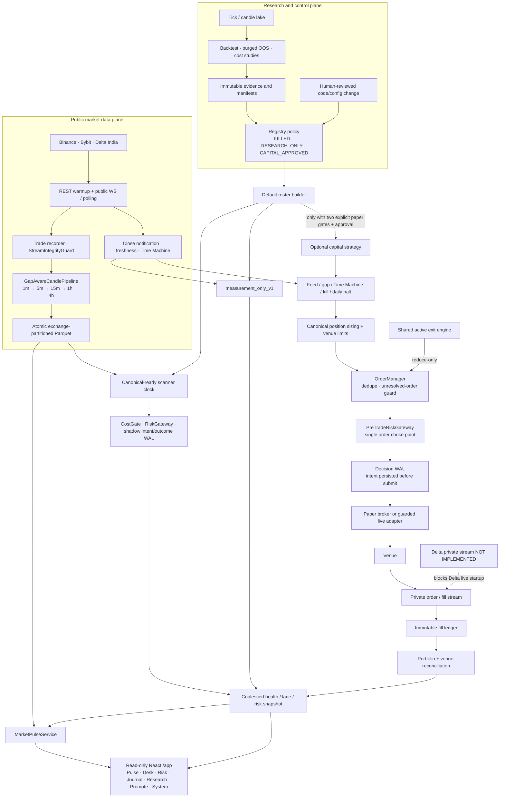
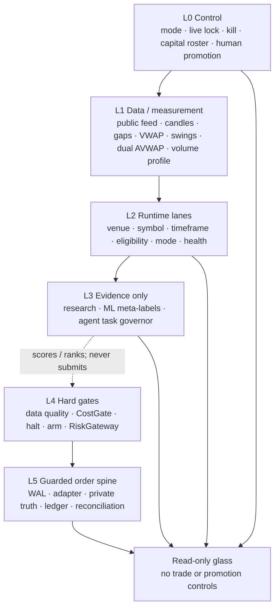
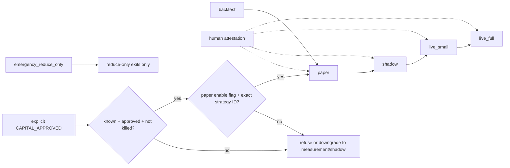
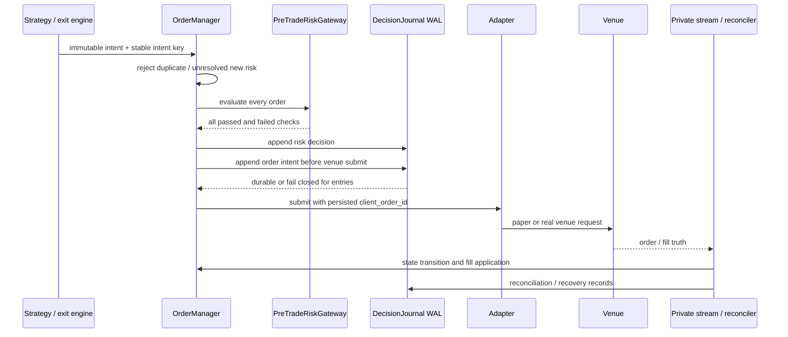

# VNEDGE architecture flow and completion map

Code-aligned status as of 2026-08-23. This document describes the current
working tree, not proof that a VM is running the same image. Runtime policy in
`strategy_registry.py`, `hf_engine_registry.py`, `multi_lane_shadow.py`, and
the pre-trade gateway takes precedence over every research or historical doc.

Status legend:

- **SHIPPED** — implemented and covered by the local test/build suite;
- **GUARDED** — code exists but is intentionally unavailable by default;
- **INTEGRATION GAP** — the component exists, but the production path does not
  yet feed or consume it end to end;
- **EXTERNAL BLOCKER** — requires VM credentials, venue access, DNS, or a real
  deployment check;
- **DEFERRED** — research-only or deliberately outside the capital path.

## End-to-end system


```mermaid
flowchart TB
    subgraph Control["Research and control plane"]
        TickLake["Tick / candle lake"] --> Research["Backtest · purged OOS · cost studies"]
        Research --> Evidence["Immutable evidence and manifests"]
        Evidence --> Registry["Registry policy<br/>KILLED · RESEARCH_ONLY · CAPITAL_APPROVED"]
        Human["Human-reviewed code/config change"] --> Registry
    end

    subgraph Public["Public market-data plane"]
        Venues["Binance · Bybit · Delta India"] --> PublicFeed["REST warmup + public WS / polling"]
        PublicFeed --> LiveDQ["Close notification · freshness · Time Machine"]
        PublicFeed --> Integrity["Trade recorder · StreamIntegrityGuard"]
        Integrity --> CandlePipe["GapAwareCandlePipeline<br/>1m → 5m → 15m → 1h → 4h"]
        CandlePipe --> CanonicalLake["Atomic exchange-partitioned Parquet"]
    end

    Registry --> Roster["Default roster builder"]
    LiveDQ --> Measure["measurement_only_v1"]
    Roster --> Measure
    CanonicalLake --> Scanner["Canonical-ready scanner clock"]
    Roster --> Scanner
    Scanner --> Shadow["CostGate · RiskGateway · shadow intent/outcome WAL"]
    Shadow --> Snapshot
    Measure --> Snapshot["Coalesced health / lane / risk snapshot"]
    CanonicalLake --> PulseService["MarketPulseService"]
    Snapshot --> PulseService
    PulseService --> Dashboard["Read-only React /app<br/>Pulse · Desk · Risk · Journal · Research · Promote · System"]
    Snapshot --> Dashboard

    Roster -. "only with two explicit paper gates + approval" .-> Strategy["Optional capital strategy"]
    LiveDQ --> EntryGates["Feed / gap / Time Machine / kill / daily halt"]
    Strategy --> EntryGates
    EntryGates --> Sizing["Canonical position sizing + venue limits"]
    Sizing --> OM["OrderManager<br/>dedupe · unresolved-order guard"]
    Exit["Shared active exit engine"] -->|"reduce-only"| OM
    OM --> Risk["PreTradeRiskGateway<br/>single order choke point"]
    Risk --> WAL["Decision WAL<br/>intent persisted before submit"]
    WAL --> Adapter["Paper broker or guarded live adapter"]
    Adapter --> Exchange["Venue"]
    Exchange --> Private["Private order / fill stream"]
    Private --> FillLedger["Immutable fill ledger"]
    FillLedger --> Recon["Portfolio + venue reconciliation"]
    Recon --> Snapshot

    DeltaBlock["Delta private stream NOT IMPLEMENTED"] -. "blocks Delta live startup" .-> Private
```

The default path ends at measurement and the dashboard. It cannot produce an
`OrderIntent`: `measurement_only_v1` returns no signal, the capital allowlist
is empty, and Compose contains no live-order service.

## Control-system hierarchy


```mermaid
flowchart TB
    Control["L0 Control<br/>mode · live lock · kill · capital roster · human promotion"]
    Measure["L1 Data / measurement<br/>public feed · candles · gaps · VWAP · swings · dual AVWAP · volume profile"]
    Lanes["L2 Runtime lanes<br/>venue · symbol · timeframe · eligibility · mode · health"]
    Evidence["L3 Evidence only<br/>research · ML meta-labels · agent task governor"]
    Gates["L4 Hard gates<br/>data quality · CostGate · halt · arm · RiskGateway"]
    Orders["L5 Guarded order spine<br/>WAL · adapter · private truth · ledger · reconciliation"]
    Glass["Read-only glass<br/>no trade or promotion controls"]

    Control --> Measure --> Lanes --> Evidence
    Evidence -. "scores / ranks; never submits" .-> Gates
    Lanes --> Glass
    Control --> Glass
    Evidence --> Glass
    Gates --> Orders
    Orders --> Glass
```

Operational priority in the glass is runtime lanes, risk/feed truth, and the
journal before promotion evidence, research, ML, or agent work. ML is a
meta-label gate over rule outcomes, not an autonomous strategy. Agentic and
Darwinian components govern research tasks and artifacts only. Neither layer
can write the capital registry, emit an order, or bypass the gateway.

## Runtime profiles and authority

| Runtime or service | Default | Authority | Current status |
|---|---:|---|---|
| `multi-lane-shadow` | yes | Public data, measurement snapshots; optional explicitly gated paper simulation | **SHIPPED** |
| `dashboard-tls` | yes | TLS reverse proxy to the read-only dashboard | **SHIPPED locally; EXTERNAL BLOCKER on VM/certificate** |
| `research-loop` | no, `research` profile | Offline/public-data evidence only | **DEFERRED from capital** |
| `live_trader_main` | no service; manual CLI | Real orders only after all live gates | **GUARDED** |

The image and Compose entrypoint are both `vnedge.runtime.scanner_startup`,
which launches retrying canonical recovery and immediately serves
`vnedge.runtime.multi_lane_shadow`. The React frontend is built in the Docker
multi-stage build and served at `/app`. Compose includes public trade/book
recorders, canonical recovery, versioned shadow scanners, and a read-only
evidence worker. Pine, automatic-promotion, and live-order services are absent.

## Permission and mode flow


```mermaid
flowchart LR
    Backtest["backtest"] --> Paper["paper"] --> Shadow["shadow"] --> Small["live_small"] --> Full["live_full"]
    ExitOnly["emergency_reduce_only"] --> Exits["reduce-only exits only"]
    Human["human attestation"] -.-> Paper
    Human -.-> Shadow
    Human -.-> Small
    Human -.-> Full

    Registry["explicit CAPITAL_APPROVED"] --> Eligible{"known + approved + not killed?"}
    Eligible -- no --> Refuse["refuse or downgrade to measurement/shadow"]
    Eligible -- yes --> Config{"paper enable flag + exact strategy ID?"}
    Config -- no --> Refuse
    Config -- yes --> Paper
```

`CAPITAL_APPROVED` and `TRADEABLE_HF_ENGINES` are empty. Funding mean
reversion remains registered only for historical replay and is `KILLED`.
Measurement is `RESEARCH_ONLY`. Unknown strategy IDs fail closed.

## Order and recovery spine


```mermaid
sequenceDiagram
    participant S as Strategy / exit engine
    participant O as OrderManager
    participant R as PreTradeRiskGateway
    participant W as DecisionJournal WAL
    participant A as Adapter
    participant V as Venue
    participant P as Private stream / reconciler

    S->>O: immutable intent + stable intent key
    O->>O: reject duplicate / unresolved new risk
    O->>R: evaluate every order
    R-->>O: all passed and failed checks
    O->>W: append risk decision
    O->>W: append order intent before venue submit
    W-->>O: durable or fail closed for entries
    O->>A: submit with persisted client_order_id
    A->>V: paper or real venue request
    V-->>P: order / fill truth
    P->>O: state transition and fill application
    P->>W: reconciliation / recovery records
```

Journal unavailability, a quarantined WAL tail, `TIMEOUT_UNKNOWN`, an account
read failure streak, or reconciliation divergence blocks new risk. Reduce-only
exits still traverse the same gateway, WAL, and adapter, but entry-quality
failures are warnings rather than exit blockers.

## Canonical candle and measurement path

The deterministic libraries are **SHIPPED**:

- timezone-aware ticks only; invalid or late trades are rejected and can be
  quarantined;
- `advance_time()` closes a trade-backed forming bucket without inventing an
  empty OHLC bucket;
- higher timeframes merge contiguous child bars and omit incomplete/gapped
  buckets;
- VWAP is always `sum(quote_volume) / sum(base_volume)`, never an average of
  child VWAP values;
- Parquet writes are locked, atomic, idempotent, and partitioned by exchange;
- gaps distinguish unproven stream coverage from a quiet market;
- AVWAP and confirmed-swing utilities are measurement/research-only.

The production integration is **SHIPPED**. `pulse-recorder` owns public trades;
archive/bootstrap and strict gap recovery deterministically build the canonical
ladder; `MarketPulseService` and scanner lanes read the same
exchange-partitioned store. Venue candle closes are notifications only. A lane
waits a bounded period for the matching canonical row, then journals
`canonical_bar_timeout` and blocks that decision bar instead of silently using
exchange OHLCV.

Startup recovery runs in a retrying worker: `/health` and the read-only cockpit
remain available, while an atomic prerequisite artifact blocks new shadow arms
until exact history is proved. Offline scanner replay and VM shadow both use
one position per lane, next-open entry, stop-before-target, and the frozen hold
contract. Evidence reports realized execution cost separately from conservative
gate cost and joins evaluations, intents, and outcomes by `intent_key`.

## Dashboard and authentication

The local React `/app` cockpit now has:

- sticky mode, capital, kill, feed, and identity status;
- permanent `live_blocked` messaging where venue/checklist truth is absent;
- lane eligibility (`KILLED`, `RESEARCH_ONLY`, eligible/unknown);
- journal recovery, daily halt, stream health, and Delta-private visibility;
- Market Pulse with Lightweight Charts, closed 1h candles, server VWAP,
  causal dual AVWAP lines, a transient forming bar, UTC labels, and true
  whitespace gaps;
- a Desk view containing the runtime lane roster only; research/catalog rows
  are never unioned into an implied active-strategy list;
- a Promote view that exposes the human checklist, empty capital roster,
  sealed `KILLED` rows, and sample buckets without any mutation control;
- a System view that distinguishes `OK`, `STALE`, and `MISSING` snapshot,
  scorecard, ML, and agent artifacts and shows the Delta-private blocker;
- subordinate ML and agent-governor cards under Research, explicitly labelled
  as evidence-only and incapable of trade or promotion;
- bounded, cached hour briefs that cannot emit signals, orders, or promotion;
- no order or mutation controls.

The navigation order is the authority order:

```text
Pulse → Desk → Risk → Journal → Research → Promote → System
```

Pulse is the default. The classic dashboard is reachable only as an explicit
legacy command-palette fallback; it is still served at `/`, so presentation
logic is not yet physically single-sourced.

Browser authentication is **COOKIE-BASED**. The operator enters the root token
on the `/app/` sign-in screen; it travels once in an authorization header and
is exchanged for a rotating 15-minute JWT held only in a Secure, HttpOnly,
SameSite cookie. Neither browser surface reads credentials from URLs or browser
storage, and WebSockets accept only the session cookie. The classic dashboard
remains a second primary surface at `/`.

## Deployment truth

Local deploy protections are **SHIPPED**:

- `/health` and `/healthz` are public, state-free liveness probes;
- `/ready` distinguishes process liveness from a warmed snapshot;
- Compose healthchecks both the app and the actual TLS listener;
- `deploy.sh` waits for edge health and then audits the running build SHA,
  live flag, capital roster, and strategy eligibility;
- the Docker image includes the production React build.

VM state is runtime evidence, not a property of this working tree. Do not mark
a deployment complete until the deployed SHA, container health, capital
roster, and fleet policy pass on-host. The IP endpoint still uses an untrusted
self-signed certificate; production browser access remains blocked on a
trusted DNS certificate even when the guarded application deployment passes.

## Completed items from the earlier audit

| Earlier gap | Code-backed state |
|---|---|
| Default capital roster should be empty | **SHIPPED** — explicit allowlist is empty |
| Killed/research strategy enforcement | **SHIPPED** — registry, roster builder, runtime downgrade, fleet audit |
| Keep scanners non-capital | **SHIPPED** — shadow-only roster; no auto-promotion service |
| Dashboard `/healthz` and edge gate | **SHIPPED locally** |
| React frontend baked into Docker | **SHIPPED** |
| Honest status, lanes, and Risk UI | **SHIPPED locally** |
| Market Pulse chart and hour strip | **SHIPPED locally** |
| React authority hierarchy (Desk/Promote/System) | **SHIPPED locally** |
| ML and agent evidence subordinate to Research | **SHIPPED locally** |
| Canonical candles, gaps, VWAP/AVWAP pipeline | **SHIPPED end to end** |
| License for the public repository | **SHIPPED locally** — MIT |
| CI visibility beyond the safety allowlist | **PARTIAL** — full-package Ruff/mypy report debt but are non-blocking |

## Remaining work, in execution order

### P0 — venue truth, authentication, and deployment

1. **Implement the native Delta private stream.** Authenticate and subscribe to
   order, position, and user-trade events; normalize them through
   `PrivateStreamEventApplier`; update the fill ledger; reconcile REST on
   reconnect; fail closed on stale sequence/freshness. Delta live must continue
   to raise until this is complete and tested.
2. **Establish deployment truth.** Restore SSH access, rotate the exposed root
   token, deploy one reviewed SHA, run `/healthz`, `/ready`, and fleet-policy
   checks on-host, then perform a live pixel pass.
3. **Replace self-signed IP TLS.** Use a DNS name with ACME renewal before HSTS;
   do not train operators to bypass certificate warnings.
4. **Add non-mocked live boot coverage.** Exercise the real factory wiring up
   to the deliberate no-network gate boundary, especially Delta adapter,
   account provider, symbol mapping, and private-stream refusal.

### P1 — complete the measurement product

1. ~~**Wire canonical ingest into the default runtime.**~~ Complete: public
   trades, deterministic candles, bounded canonical-ready decisions, startup
   proof, and gap recovery are Compose-owned.
2. ~~**Wire AVWAP history into Pulse.**~~ Complete: deterministic 3-left/3-right
   closed-hour anchors feed dual AVWAP series, bias, and explicit anchor plus
   `confirmed_at` provenance. Forming-hour bias is preview-only and cannot
   confirm an anchor.
3. **Unify the cockpit.** Make React `/app` the documented production root,
   retain classic only as an explicit legacy fallback, then remove duplicated
   presentation logic.
4. **Use the coalesced Pulse stream or a ≤2s snapshot cadence.** React currently
   polls Pulse every 10 seconds even though a five-second server stream exists.
5. **Add an external uptime check.** Container health cannot detect DNS,
   firewall, certificate, or public routing failure.

### P1 — capital economics before any approval

1. **Require one after-cost contract for future capital strategies.** The hard
   `CostGate` exists for HF paths, while ordinary BaseStrategy entry paths use
   spread/slippage/funding risk limits but do not prove expected edge exceeds
   full round-trip cost before sizing. With an empty capital allowlist this is
   safe today; it is a blocker for adding any ID to `CAPITAL_APPROVED`.
2. **Keep HF/scalping engines out of capital.** The engine allowlist is empty;
   research modules and frequent signals must not be mistaken for economic
   permission.

### P2 — engineering and governance debt

1. Turn full-package Ruff/mypy from non-blocking visibility into an incremental
   ratchet until the whole runtime is enforced.
2. Reduce strategy/research module sprawl. There are 23 top-level strategy
   modules but only seven registered strategies, plus 55 research and eight
   scalping modules. Classify utilities separately and quarantine/delete
   unreferenced candidates without changing historical evidence.
3. Apply an explicit `ACTIVE`, `RESEARCH_ONLY`, `KILLED`, or `HISTORICAL` banner
   to individual docs; `STATUS_INDEX.md` supplies precedence but does not stamp
   every file.
4. Run real crash tests for partial WAL writes, restart with unresolved orders,
   private-stream disconnect, and reconciliation mismatch against testnet or a
   deterministic venue harness.

## Promotion boundary

Nothing in measurement, Market Pulse, AVWAP, AI briefs, research agents, or a
document can add capital permission. Promotion requires reviewed code that
adds the exact strategy ID to `CAPITAL_APPROVED`, evidence from a
pre-registered untouched window, after-cost economics, paper evidence, and the
human mode ladder. Until then the north star remains:

> Measure always. Decide rarely. Pay costs explicitly. Live last.
