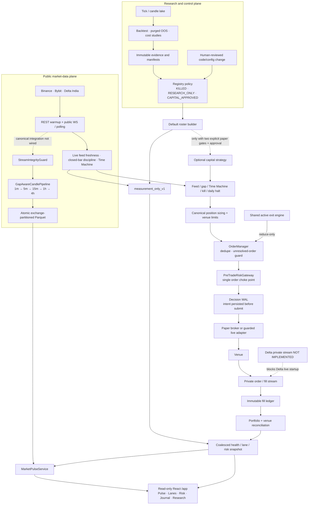
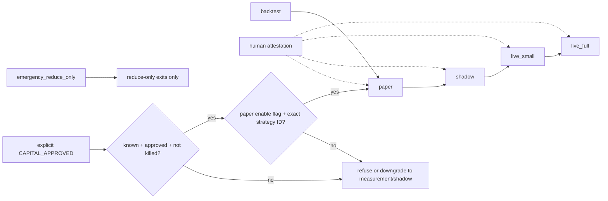
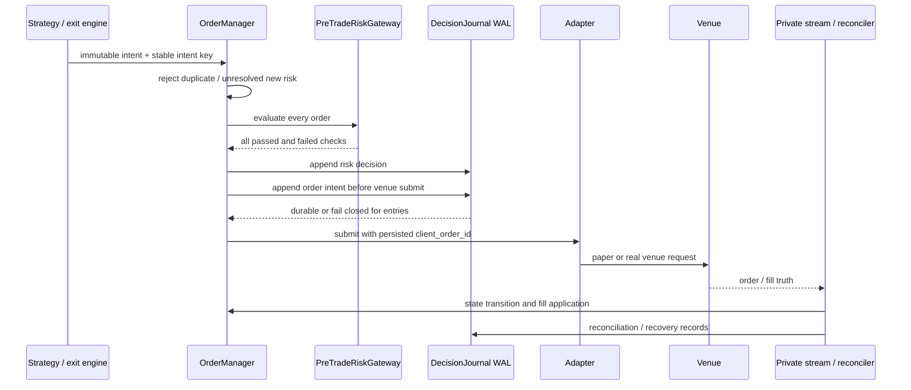

# VNEDGE architecture flow and completion map

Code-aligned status as of 2026-08-16. This document describes the current
working tree, not proof that a VM is running the same image. Runtime policy in
`strategy_registry.py`, `hf_engine_registry.py`, `multi_lane_shadow.py`, and
the pre-trade gateway takes precedence over every research or historical doc.

Status legend:

- **SHIPPED** — implemented and covered by the local test/build suite;
- **GUARDED** — code exists but is intentionally unavailable by default;
- **INTEGRATION GAP** — the component exists, but the production path does not
  yet feed or consume it end to end;
- **EXTERNAL BLOCKER** — requires VM credentials, venue access, DNS, or a real
  deployment check;
- **DEFERRED** — research-only or deliberately outside the capital path.

## End-to-end system

```mermaid
flowchart TB
    subgraph Control["Research and control plane"]
        TickLake["Tick / candle lake"] --> Research["Backtest · purged OOS · cost studies"]
        Research --> Evidence["Immutable evidence and manifests"]
        Evidence --> Registry["Registry policy<br/>KILLED · RESEARCH_ONLY · CAPITAL_APPROVED"]
        Human["Human-reviewed code/config change"] --> Registry
    end

    subgraph Public["Public market-data plane"]
        Venues["Binance · Bybit · Delta India"] --> PublicFeed["REST warmup + public WS / polling"]
        PublicFeed --> LiveDQ["Live feed freshness · closed-bar discipline · Time Machine"]
        PublicFeed -. "canonical integration not wired" .-> Integrity["StreamIntegrityGuard"]
        Integrity --> CandlePipe["GapAwareCandlePipeline<br/>1m → 5m → 15m → 1h → 4h"]
        CandlePipe --> CanonicalLake["Atomic exchange-partitioned Parquet"]
    end

    Registry --> Roster["Default roster builder"]
    LiveDQ --> Measure["measurement_only_v1"]
    Roster --> Measure
    Measure --> Snapshot["Coalesced health / lane / risk snapshot"]
    CanonicalLake --> PulseService["MarketPulseService"]
    Snapshot --> PulseService
    PulseService --> Dashboard["Read-only React /app<br/>Pulse · Lanes · Risk · Journal · Research"]
    Snapshot --> Dashboard

    Roster -. "only with two explicit paper gates + approval" .-> Strategy["Optional capital strategy"]
    LiveDQ --> EntryGates["Feed / gap / Time Machine / kill / daily halt"]
    Strategy --> EntryGates
    EntryGates --> Sizing["Canonical position sizing + venue limits"]
    Sizing --> OM["OrderManager<br/>dedupe · unresolved-order guard"]
    Exit["Shared active exit engine"] -->|"reduce-only"| OM
    OM --> Risk["PreTradeRiskGateway<br/>single order choke point"]
    Risk --> WAL["Decision WAL<br/>intent persisted before submit"]
    WAL --> Adapter["Paper broker or guarded live adapter"]
    Adapter --> Exchange["Venue"]
    Exchange --> Private["Private order / fill stream"]
    Private --> FillLedger["Immutable fill ledger"]
    FillLedger --> Recon["Portfolio + venue reconciliation"]
    Recon --> Snapshot

    DeltaBlock["Delta private stream NOT IMPLEMENTED"] -. "blocks Delta live startup" .-> Private
```

The default path ends at measurement and the dashboard. It cannot produce an
`OrderIntent`: `measurement_only_v1` returns no signal, the capital allowlist
is empty, and Compose contains no live-order service.

## Runtime profiles and authority

| Runtime or service | Default | Authority | Current status |
|---|---:|---|---|
| `multi-lane-shadow` | yes | Public data, measurement snapshots; optional explicitly gated paper simulation | **SHIPPED** |
| `dashboard-tls` | yes | TLS reverse proxy to the read-only dashboard | **SHIPPED locally; EXTERNAL BLOCKER on VM/certificate** |
| `research-loop` | no, `research` profile | Offline/public-data evidence only | **DEFERRED from capital** |
| `live_trader_main` | no service; manual CLI | Real orders only after all live gates | **GUARDED** |

The image default and Compose default are both
`vnedge.runtime.multi_lane_shadow`. The React frontend is built in the Docker
multi-stage build and served at `/app`. Scanner, Pine, alpha-uplift, automatic
manifest/promotion, and live-order services are absent from Compose.

## Permission and mode flow

```mermaid
flowchart LR
    Backtest["backtest"] --> Paper["paper"] --> Shadow["shadow"] --> Small["live_small"] --> Full["live_full"]
    ExitOnly["emergency_reduce_only"] --> Exits["reduce-only exits only"]
    Human["human attestation"] -.-> Paper
    Human -.-> Shadow
    Human -.-> Small
    Human -.-> Full

    Registry["explicit CAPITAL_APPROVED"] --> Eligible{"known + approved + not killed?"}
    Eligible -- no --> Refuse["refuse or downgrade to measurement/shadow"]
    Eligible -- yes --> Config{"paper enable flag + exact strategy ID?"}
    Config -- no --> Refuse
    Config -- yes --> Paper
```

`CAPITAL_APPROVED` and `TRADEABLE_HF_ENGINES` are empty. Funding mean
reversion remains registered only for historical replay and is `KILLED`.
Measurement is `RESEARCH_ONLY`. Unknown strategy IDs fail closed.

## Order and recovery spine

```mermaid
sequenceDiagram
    participant S as Strategy / exit engine
    participant O as OrderManager
    participant R as PreTradeRiskGateway
    participant W as DecisionJournal WAL
    participant A as Adapter
    participant V as Venue
    participant P as Private stream / reconciler

    S->>O: immutable intent + stable intent key
    O->>O: reject duplicate / unresolved new risk
    O->>R: evaluate every order
    R-->>O: all passed and failed checks
    O->>W: append risk decision
    O->>W: append order intent before venue submit
    W-->>O: durable or fail closed for entries
    O->>A: submit with persisted client_order_id
    A->>V: paper or real venue request
    V-->>P: order / fill truth
    P->>O: state transition and fill application
    P->>W: reconciliation / recovery records
```

Journal unavailability, a quarantined WAL tail, `TIMEOUT_UNKNOWN`, an account
read failure streak, or reconciliation divergence blocks new risk. Reduce-only
exits still traverse the same gateway, WAL, and adapter, but entry-quality
failures are warnings rather than exit blockers.

## Canonical candle and measurement path

The deterministic libraries are **SHIPPED**:

- timezone-aware ticks only; invalid or late trades are rejected and can be
  quarantined;
- `advance_time()` closes a trade-backed forming bucket without inventing an
  empty OHLC bucket;
- higher timeframes merge contiguous child bars and omit incomplete/gapped
  buckets;
- VWAP is always `sum(quote_volume) / sum(base_volume)`, never an average of
  child VWAP values;
- Parquet writes are locked, atomic, idempotent, and partitioned by exchange;
- gaps distinguish unproven stream coverage from a quiet market;
- AVWAP and confirmed-swing utilities are measurement/research-only.

The production integration is an **INTEGRATION GAP**. No default runtime
currently constructs `GapAwareCandlePipeline` or writes the canonical candle
store. `MarketPulseService` reads `data/candles`, so a fresh Compose deployment
can show an empty Pulse even while the older live-feed/Time-Machine path is
healthy. The next data-plane change must connect public trades/heartbeats to
the canonical writer and surface its gap state in the runtime snapshot. It
must not replace missing trades with exchange OHLC or synthetic zero-volume
bars.

## Dashboard and authentication

The local React `/app` cockpit now has:

- sticky mode, capital, kill, feed, and identity status;
- permanent `live_blocked` messaging where venue/checklist truth is absent;
- lane eligibility (`KILLED`, `RESEARCH_ONLY`, eligible/unknown);
- journal recovery, daily halt, stream health, and Delta-private visibility;
- Market Pulse with Lightweight Charts, closed 1h candles, server VWAP,
  optional AVWAP price line, a transient forming bar, UTC labels, and true
  whitespace gaps;
- bounded, cached hour briefs that cannot emit signals, orders, or promotion;
- no order or mutation controls.

Authentication is only **PARTIALLY COMPLETE**. The server can exchange a root
token for a 15-minute JWT, but the React client still reads `?token=` and sends
that value on every request. There is no HttpOnly cookie login flow yet, and
the classic dashboard remains a second primary surface at `/`.

## Deployment truth

Local deploy protections are **SHIPPED**:

- `/health` and `/healthz` are public, state-free liveness probes;
- `/ready` distinguishes process liveness from a warmed snapshot;
- Compose healthchecks both the app and the actual TLS listener;
- `deploy.sh` waits for edge health and then audits the running build SHA,
  live flag, capital roster, and strategy eligibility;
- the Docker image includes the production React build.

The current VM remains an **EXTERNAL BLOCKER**, not a verified success. This
workspace has no usable SSH identity for the host, and the observed IP endpoint
uses an untrusted self-signed certificate. Therefore the deployed SHA, token
rotation, container health, roster, and dashboard pixel state are unknown.
Do not mark deployment complete until the fleet policy passes on-host and the
public endpoint uses a trusted DNS certificate.

## Completed items from the earlier audit

| Earlier gap | Code-backed state |
|---|---|
| Default capital roster should be empty | **SHIPPED** — explicit allowlist is empty |
| Killed/research strategy enforcement | **SHIPPED** — registry, roster builder, runtime downgrade, fleet audit |
| Remove scanner services | **SHIPPED** — no scanner/auto-promotion service in Compose |
| Dashboard `/healthz` and edge gate | **SHIPPED locally** |
| React frontend baked into Docker | **SHIPPED** |
| Honest status, lanes, and Risk UI | **SHIPPED locally** |
| Market Pulse chart and hour strip | **SHIPPED locally** |
| Canonical candles, gaps, VWAP/AVWAP libraries | **SHIPPED as libraries** |
| License for the public repository | **SHIPPED locally** — MIT |
| CI visibility beyond the safety allowlist | **PARTIAL** — full-package Ruff/mypy report debt but are non-blocking |

## Remaining work, in execution order

### P0 — venue truth, authentication, and deployment

1. **Implement the native Delta private stream.** Authenticate and subscribe to
   order, position, and user-trade events; normalize them through
   `PrivateStreamEventApplier`; update the fill ledger; reconcile REST on
   reconnect; fail closed on stale sequence/freshness. Delta live must continue
   to raise until this is complete and tested.
2. **Finish cookie authentication.** Add a login exchange that sets an
   `HttpOnly; Secure; SameSite=Strict` short-lived cookie, authenticate HTTP
   from the cookie, define a safe WebSocket session mechanism, strip tokens
   from browser URLs/history, and remove frontend query-token propagation.
3. **Establish deployment truth.** Restore SSH access, rotate the exposed root
   token, deploy one reviewed SHA, run `/healthz`, `/ready`, and fleet-policy
   checks on-host, then perform a live pixel pass.
4. **Replace self-signed IP TLS.** Use a DNS name with ACME renewal before HSTS;
   do not train operators to bypass certificate warnings.
5. **Add non-mocked live boot coverage.** Exercise the real factory wiring up
   to the deliberate no-network gate boundary, especially Delta adapter,
   account provider, symbol mapping, and private-stream refusal.

### P1 — complete the measurement product

1. **Wire canonical ingest into the default runtime.** Feed trades and
   heartbeats into `GapAwareCandlePipeline`, persist closed bars, propagate
   `data_degraded`, and make Pulse non-empty on a clean deployment.
2. **Wire AVWAP history into Pulse.** The math exists, but the service currently
   reports `avwap=null` and `dual_avwap_bias=unavailable`; add explicit anchor
   provenance and `confirmed_at` to the API before drawing a series.
3. **Unify the cockpit.** Make React `/app` the documented production root,
   retain classic only as an explicit legacy fallback, then remove duplicated
   presentation logic.
4. **Use the coalesced Pulse stream or a ≤2s snapshot cadence.** React currently
   polls Pulse every 10 seconds even though a five-second server stream exists.
5. **Add an external uptime check.** Container health cannot detect DNS,
   firewall, certificate, or public routing failure.

### P1 — capital economics before any approval

1. **Require one after-cost contract for future capital strategies.** The hard
   `CostGate` exists for HF paths, while ordinary BaseStrategy entry paths use
   spread/slippage/funding risk limits but do not prove expected edge exceeds
   full round-trip cost before sizing. With an empty capital allowlist this is
   safe today; it is a blocker for adding any ID to `CAPITAL_APPROVED`.
2. **Keep HF/scalping engines out of capital.** The engine allowlist is empty;
   research modules and frequent signals must not be mistaken for economic
   permission.

### P2 — engineering and governance debt

1. Turn full-package Ruff/mypy from non-blocking visibility into an incremental
   ratchet until the whole runtime is enforced.
2. Reduce strategy/research module sprawl. There are 23 top-level strategy
   modules but only seven registered strategies, plus 55 research and eight
   scalping modules. Classify utilities separately and quarantine/delete
   unreferenced candidates without changing historical evidence.
3. Apply an explicit `ACTIVE`, `RESEARCH_ONLY`, `KILLED`, or `HISTORICAL` banner
   to individual docs; `STATUS_INDEX.md` supplies precedence but does not stamp
   every file.
4. Run real crash tests for partial WAL writes, restart with unresolved orders,
   private-stream disconnect, and reconciliation mismatch against testnet or a
   deterministic venue harness.

## Promotion boundary

Nothing in measurement, Market Pulse, AVWAP, AI briefs, research agents, or a
document can add capital permission. Promotion requires reviewed code that
adds the exact strategy ID to `CAPITAL_APPROVED`, evidence from a
pre-registered untouched window, after-cost economics, paper evidence, and the
human mode ladder. Until then the north star remains:

> Measure always. Decide rarely. Pay costs explicitly. Live last.
