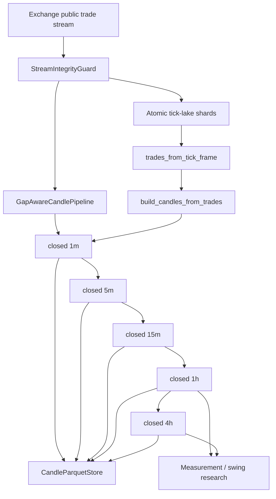

# Canonical candle pipeline

VNEDGE can construct deterministic candles from its recorded trade lake without
depending on exchange-provided OHLCV. The implementation is in
`vnedge.data.candles`; existing exchange OHLCV ingestion remains compatible and
unchanged.

## Frozen market records

The canonical data plane has three persisted record contracts and one mutable
memory bucket. They are deliberately not interchangeable:

| Record | Authority | Persisted | Consumer |
|---|---|---|---|
| `PublicTrade` | trade price/size/aggressor | raw trade shard | `CandlePipeline` only |
| `LaneBBO` | executable bid/ask seen by one lane | quote evidence shard | accept/chase/tick-stop replay |
| closed `Candle` | causal OHLCV for one identity | candle Parquet | scanner `prepare` / arm |
| forming 1m `Candle` | current observed trade bucket | never | UI ghost + recorder health |

`PublicTrade` logically includes `(exchange, canonical_symbol, trade_id)`;
exchange and symbol live in Parquet partition names. Quote notional and taker
buy volume are derived once from price, amount, and `is_buyer_maker`. Invalid,
future-clock, and id-less public prints are rejected at ingress. Delta's public
feed currently omits a native trade id, so its recorder assigns an explicit
`delta-synthetic:` content identity and deduplicates it within a bounded
window.

`LaneBBO` is captured after lane dequeue with event time, receipt time, native
sequence, source, overflow counters, lane id, and capture time. Non-positive or
crossed books are invalid. Replay order is `(event time, receipt time, native
sequence, stable input order)`. BBO/mid never creates or repaints OHLC.

The hot/warm/cold split is therefore:

```text
hot:   one forming 1m candle + last BBO + bounded quote queue
warm:  immutable router closed-candle objects
cold:  fsync'd raw-trade shards + atomic canonical-candle Parquet
```

The raw trade shard is fsync'd before a boundary trade may publish a closed
candle. Parquet candle persistence remains the audit/restart sink; any persist
failure marks the producer unhealthy and blocks new arms without blocking
reduce-only exits.



## Live construction

```python
from decimal import Decimal
from pathlib import Path

from vnedge.data.candles import CandleParquetStore, CandlePipeline

store = CandleParquetStore(
    Path("data/candles"),
    exchange="binanceusdm",
)
pipeline = CandlePipeline("BTC/USDT:USDT", store=store)

# False means the buyer was the taker.
closed = pipeline.on_trade(timestamp, Decimal("63750.5"), Decimal("0.01"), False)
for candle in closed:
    notify_measurement_subscribers(candle)

# A timer may close the final forming minute when no boundary trade arrives.
closed = pipeline.advance_time(now)
```

Use `base_timeframe="1s"` only for explicit research replay. The default live
base is `1m`. `advance_time(now)` closes the one forming bar when
`close_time <= now`; it finalizes only already-observed trades. It never creates
OHLC from a midpoint and never fills subsequent quiet buckets.

Late or out-of-order trades raise, are logged, and cannot rewrite a closed
partition. Operators may attach the durable forensic sink:

```python
from vnedge.data.candles import JsonlTradeQuarantine

pipeline = CandlePipeline(
    "BTC/USDT:USDT",
    store=store,
    rejected_trade_sink=JsonlTradeQuarantine("logs/rejected_candle_trades.jsonl"),
)
```

## Exchange data integrity and recovery

`vnedge.data.gaps` separates a healthy quiet market from unknown coverage. A
heartbeat is a valid stream message even when it contains no trade, so regular
heartbeats keep the feed healthy without creating empty candles. A stale
message clock, sequence break, failed backfill, storage hole, or late trade is
an explicit integrity event.

```python
from datetime import timedelta

from vnedge.data.gaps import (
    GapAwareCandlePipeline,
    GapParquetStore,
    IdentifiedTrade,
)

pipeline = GapAwareCandlePipeline(
    "binanceusdm",
    "BTC/USDT:USDT",
    monitoring_started_at=started_at,
    stale_after=timedelta(seconds=10),
    candle_store=store,
    gap_store=GapParquetStore("data/gaps"),
)

pipeline.on_heartbeat(received_at, sequence_id=sequence_id)
pipeline.on_trade(
    IdentifiedTrade(trade_id, event_time, price, amount),
    received_at=received_at,
    sequence_id=sequence_id,
)
closed = pipeline.advance_time(now)
```

The live state contract is fail-closed:

| State | Candle close | New entries | Reduce-only exits |
|---|---|---|---|
| Healthy, including no trades | Close observed forming state; skip empty buckets | Other gates decide | Allowed |
| Stale or sequence gap | Frozen | Blocked | Allowed with integrity warning |
| Backfill succeeded | Rebuild only the current forming bar | Blocked until a fresh live message warms the feed | Allowed |
| Backfill failed | Hole remains explicit | Blocked | Allowed with integrity warning |

After reconnect, request the guard's overlap range and deduplicate the REST
result by exchange trade ID:

```python
start, end = pipeline.guard.backfill_window(now, overlap=timedelta(minutes=2))
backfill = fetch_identified_trades(start, end)
pipeline.recover(
    backfill,
    at=now,
    continuity_proven=rest_pages_are_complete,
    detail="REST overlap verified",
)
```

Recovery never rewrites a closed candle or closed Parquet partition. It merges
the overlap idempotently by `trade_id`, rebuilds only the open 1m bucket, and
requires one subsequent healthy stream message before `entries_blocked`
clears. Every integrity event is atomically upserted under:

```text
data/gaps/exchange=binanceusdm/symbol=BTCUSDT/2026-08-16.parquet
```

Consumers copy `pipeline.data_degraded` into `MarketState.data_degraded`. The
pre-trade gateway rejects risk-increasing orders on that hard check while
keeping reduce-only exits available. The gap module itself remains
measurement-only and cannot emit an order.

## Offline reconstruction

```python
import pandas as pd

from vnedge.data.candles import build_candles_from_trades, trades_from_tick_frame

tick_frame = pd.read_parquet(tick_shard)
trades = trades_from_tick_frame(tick_frame)
candles = build_candles_from_trades(
    "BTC/USDT:USDT",
    trades,
    close_through=known_dataset_end,
)
four_hour = candles["4h"]
```

`aggregate_candle_series` can also resample a closed lower-timeframe series
directly. A 4h result requires exactly four consecutive, UTC-aligned 1h bars.

Research must use `candles_without_gaps` or report `coverage_fraction`; neither
path forward-fills OHLC. `storage_holes_from_days` audits missing expected
shards. `offline_trade_time_holes` can flag large timestamp intervals only when
the caller explicitly asserts `continuous_coverage_expected=True`; trade-time
distance by itself is not evidence of a gap because the market may be quiet.

## VWAP windows

`vnedge.data.vwap` provides the shared Decimal implementation for trade, bar,
session, and rolling windows:

```python
from vnedge.data.vwap import RunningVWAP, SessionVWAP, price_vs_vwap_bps

bar = RunningVWAP()
bar_vwap = bar.update(price, amount)

session = SessionVWAP(session_start_hour_utc=0)
session_vwap = session.on_trade(timestamp, price, amount)
distance_bps = price_vs_vwap_bps(price, session_vwap)
```

The candle builder and higher-timeframe merger call the same
`vwap_from_sums(quote_volume, volume)` helper. Child VWAP values are never
averaged: higher-timeframe VWAP is always `Σ child quote / Σ child base`.
Invalid ticks (`price <= 0`, `amount <= 0`, or non-finite values) are skipped by
the standalone accumulators and cannot contaminate their active window.

## Anchored VWAP research

`AnchoredVWAP` resets on a meaningful event rather than an arbitrary session
clock. It accepts either exact trades from the anchor timestamp or closed
candles from the anchor bar, but never mixes the two input modes:

```python
from vnedge.data.vwap import AnchoredVWAP, anchored_vwap_series

# Exact tick path: includes trades at or after the event timestamp.
event_avwap = AnchoredVWAP(event_timestamp, anchor_label="breakout")
value = event_avwap.on_trade(timestamp, price, amount)

# Closed-bar research path: exact Σquote / Σbase from bar index 20 onward.
# HLC3 and close-price approximations are not used.
series = anchored_vwap_series(four_hour_candles, anchor=20)
```

When a timestamp falls inside a candle, bar mode skips that partial candle and
starts at the next complete bar. `confirmed_swing_anchors(candles, length=3)`
is the backward-compatible symmetric rule. The canonical detector lives in
`vnedge.data.swings` and accepts a frozen `SwingDetectConfig(left, right,
strict)`. Strict mode rejects tied extrema; non-strict mode deterministically
uses the earliest tied bar. Each anchor carries its historical `anchor_time`
and a later `confirmed_at`, defined as the **close** of bar `i + right`. Use
`anchor.is_confirmed(now)` before consumption; using the right bar's open or
any earlier time introduces lookahead.

`dual_avwap_bias` is measurement-only context:

- above both swing-low and swing-high AVWAPs → `strong_long`;
- below both → `strong_short`;
- between them → `between` / no directional conclusion.

No AVWAP helper places orders or grants promotion. Any strategy using these
measurements still goes through pre-registration, purged OOS validation,
CostGate, and the normal mode ladder.

Pulse pre-registers the 1h configuration as `left=3, right=3, strict=True`.
For every closed hour it selects only the latest low/high anchors already
confirmed at that hour, computes both AVWAPs from exact quote/base sums, and
publishes the bias plus anchor/confirmation provenance. The forming hour may
preview location against the last closed anchor pair; it never confirms a new
swing.

`WILLIAMS_FRACTAL_CONFIG` provides the classic strict `left=2, right=2`
special case. Known integrity gaps are passed as explicit ineligible bars: any
L/R window touching one is suppressed, and Pulse resets both active AVWAP
anchors at the gap. It stays `n/a` until a fresh post-gap low/high pair is
causally confirmed. Timestamp distance alone is not a gap because a quiet
crypto bucket may legitimately contain no trades. ATR protrusion and polarity
alternation remain optional research configurations; they are not silently
enabled in the production measurement default.

## Storage

The store adds an exchange partition to prevent multi-venue collisions:

```text
data/candles/
  exchange=binanceusdm/
    BTCUSDT/
      1m/2026-08-16.parquet
      1h/2026-08.parquet
      4h/2026-08.parquet
```

Writes are atomic and idempotent by `open_time`. A per-partition advisory lock
serializes concurrent research/live read-modify-replace writers, while atomic
rename means readers see either the old complete file or the new complete file.
Intraday bars use daily files; 1h and 4h bars use monthly files. Decimal values
are persisted as Parquet `decimal128(38, 18)` rather than binary floats.

## Runtime boundary

```text
Tick lake / public WS
  -> CandlePipeline (1m live base)
  -> closed 1h / 4h
  -> MeasurementEngine / optional AVWAP series
  -> empty or human-governed strategy registry
  -> no automatic entries

Tick Parquet
  -> trades_from_tick_frame
  -> build_candles_from_trades
  -> anchored_vwap_series / confirmed_swing_anchors
  -> pre-registered backtest only
```

These modules cannot set `tradeable=True`, grant capital eligibility, or emit
an `OrderIntent`. Risk gateway, CostGate, kill policy, and promotion rules remain
downstream. The only runtime coupling is the hard `MarketState.data_degraded`
check described above.

## Live Market Pulse wiring

The default compose stack runs `pulse-recorder` as a public, trades-only
Binance USDM stream for BTC, ETH, and SOL. Every trade is written to the tick
lake and passed to `CandlePipeline`; only closed bars are persisted under
`data/candles/exchange=binanceusdm`. The dashboard reads that store and remains
strictly read-only.

After a fresh deployment, recent Binance Vision trade archives can seed the
same store without substituting exchange OHLCV:

```bash
python -m vnedge.data.aggtrades_backfill \
  --symbols BTC/USDT:USDT,ETH/USDT:USDT,SOL/USDT:USDT --days 3
python -m vnedge.data.candle_bootstrap \
  --symbols BTC/USDT:USDT,ETH/USDT:USDT,SOL/USDT:USDT --days 3
```

The scanner roster uses a stricter startup barrier in Compose. It keeps at
least 23 complete archive days (enough for both the 2,065-bar 5m squeeze and
2,017-bar 15m range feature windows), then recovers the unpublished closed tail from strict Binance REST
aggregate trades at 5m granularity. Candle replay is delta-only: canonical 1m
minutes already present are skipped and only missing complete parent buckets
are repaired. The scanner container runs this sequence inside its own
entrypoint on every process start, including Docker daemon and host restarts;
the lane runtime is exec'd only after readiness succeeds. Fully canonical
archive shards are skipped without scanning their trade rows. Historical
quote-hold samples are not fabricated;
`book-recorder` collects that evidence forward.

The final prerequisite step writes
`data/reports/scanner_prerequisites.json` and proves a current, contiguous,
trade-derived ladder for both BTC and ETH: 288 x 5m, 96 x 15m, 24 x 1h, and
6 x 4h closed bars. Missing or stale bars, zero quote volume, absent trade
counts, or missing VWAP make the service exit non-zero.

The live recorder then appends forward. Missing tick coverage stays visible;
neither command creates empty bars or midpoint-derived OHLC.

For an audited current-day `storage_hole` whose daily Vision archive is not yet
published, recover the exact interval from Binance's public aggregate-trade API:

```bash
python -m vnedge.data.binance_gap_recovery \
  --symbols BTC/USDT:USDT,ETH/USDT:USDT,SOL/USDT:USDT
```

The recovery command reads the persisted gap boundaries, rate-limits REST
pagination, requires contiguous aggregate-trade IDs, atomically writes the live
tick shards, replays canonical candles, and only then marks the gap recovered.
Any fetch or replay inconsistency leaves the gap open.

## Enforced invariants

- Timestamps must be timezone-aware and align to UTC Unix-epoch buckets.
- Forming candles are never published or persisted.
- Late trades and duplicate/out-of-order source candles fail closed.
- Stream staleness or sequence discontinuity freezes finalization and blocks entries.
- Recovery is overlap-safe by exchange trade ID and mutates only forming state.
- Every known integrity gap is persisted for audit and OOS filtering.
- Empty buckets are skipped; VNEDGE never fabricates zero-volume OHLC.
- Higher bars require complete consecutive lower bars inside one target bucket.
- Offline tick frames are stably sorted, making replay deterministic.
