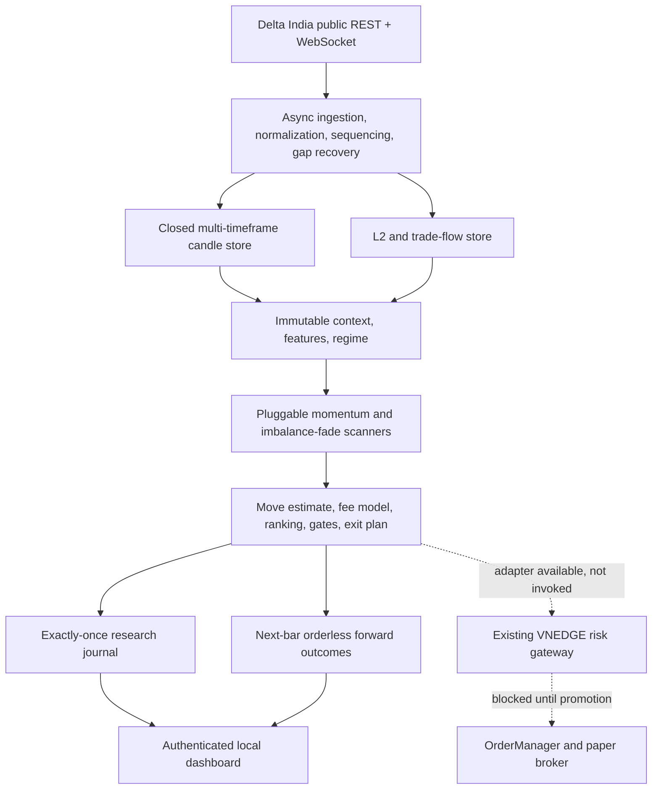

# VNEDGE Delta India Scalper Engine — System Architecture

Version 1.0, implemented 5 August 2026.

## Deployed topology



The deployed service is one asyncio process, but it is a research sidecar. It
does not instantiate an account client, `OrderManager`, or broker. Describing
it as already embedded in the main execution kernel would be inaccurate.

## Closed-candle signal sequence

```mermaid
sequenceDiagram
    participant WS as Delta public WS
    participant Store as Candle store
    participant Ctx as Context builder
    participant Scan as Scanner engine
    participant Gate as Signal and fee gates
    participant WAL as Research journal
    participant Fwd as Forward tracker

    WS->>Store: completed 1m or 5m candle
    Store->>Store: reject duplicate, future, or regressing close
    Store->>Ctx: read immutable closed snapshots
    Ctx->>Scan: features, regime, funding, L2 confirmation
    Scan->>Gate: zero or more complete candidates
    Gate->>Gate: cost, probability, confidence, symbol and dedup gates
    Gate->>WAL: journal decision exactly once
    alt candidate accepted
        Gate->>Fwd: register observation
        Fwd->>Fwd: enter at next 1m open; resolve stop-first
        Fwd->>WAL: MFE, MAE, expected and realized net bps
    else candidate rejected
        Gate->>WAL: journal rejection reasons
    end
```

## Live/replay parity

`build_delta_scalper_assembly()` is the single construction path for the
context builder, regime engine, move predictor, scanners, fee model, and final
gates. Both the live shadow service and offline replay load the same strict
YAML configuration and call that factory. Historical replay omits L2 because
candle history cannot reconstruct an event-level book; live L2 remains an
attached confirmation field and never changes the candle trigger.

## Current component status

| Layer | Implementation | Status |
|---|---|---|
| Data | Public WS, REST backfill, candle gaps, sequence checks | Active |
| Intelligence | Shared features, regimes, deterministic move predictor | Active |
| Decision | Two scanners, costs, ranking, complete exit path | Active |
| Research | Causal replay, untouched split, fee sensitivity, forward outcomes | Active |
| Control | Strict YAML, snapshots, journal, authenticated dashboard | Active |
| Existing risk core | Risk adapter using the existing gateway | Available, not invoked |
| Execution | OrderManager, account stream and broker | Not constructed |

## Promotion boundary

The supplied diagram's final happy-path step—submission to the existing risk
gateway—is a future paper-mode boundary, not current behavior. The 2025-to-date
untouched evidence fails the configured profitability and data-quality gates.
Consequently the machine-readable architecture manifest and dashboard enforce
`order_route_present=false`, `can_trade=false`, and `can_promote=false`.
