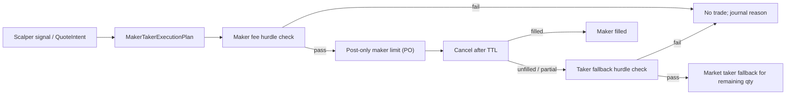

# Executor Runtime: Maker-First With Taker Fallback

VNEDGE scalper signals should not map directly to venue orders. A signal creates
an execution plan, and the executor decides how to work that plan while staying
inside the existing gateway, journal, idempotency, and reconciliation contracts.

The first executor is implemented in
`src/vnedge/execution/maker_taker_executor.py`.

## Flow

## Route Rules

- Maker entry is always submitted as a limit order with `time_in_force="PO"`.
- Taker fallback is evaluated after the maker quote fails to fill or only
  partially fills.
- Callers may pass fresh account and market snapshots at fallback time so
  partial fills and changed quotes are reflected before the market order is
  considered.
- Taker fallback uses the higher `taker_round_trip_cost_bps` from the frozen
  scalper fee registry.
- If the remaining expected edge no longer covers the taker hurdle, the
  executor cancels and journals `taker_blocked`.
- Partial maker fills fall back only for the remaining quantity.
- `TIMEOUT_UNKNOWN` on maker submit or cancel stops the executor immediately;
  no fallback order is allowed while venue truth is unknown.

## Safety Contract

The executor never calls an exchange adapter directly. It only calls:

- `OrderManager.submit(...)`
- `OrderManager.cancel_order(...)`

That preserves:

- `PreTradeRiskGateway.evaluate()` on every order
- decision journal before venue submission
- fresh client order ids minted once by the order manager
- unresolved-order fail-closed behavior
- reduce-only exit policy remaining separate from entry-quality checks

This module is an execution workflow primitive. It does not promote lanes, does
not bypass replay/paper/shadow, and does not enable live trading.
