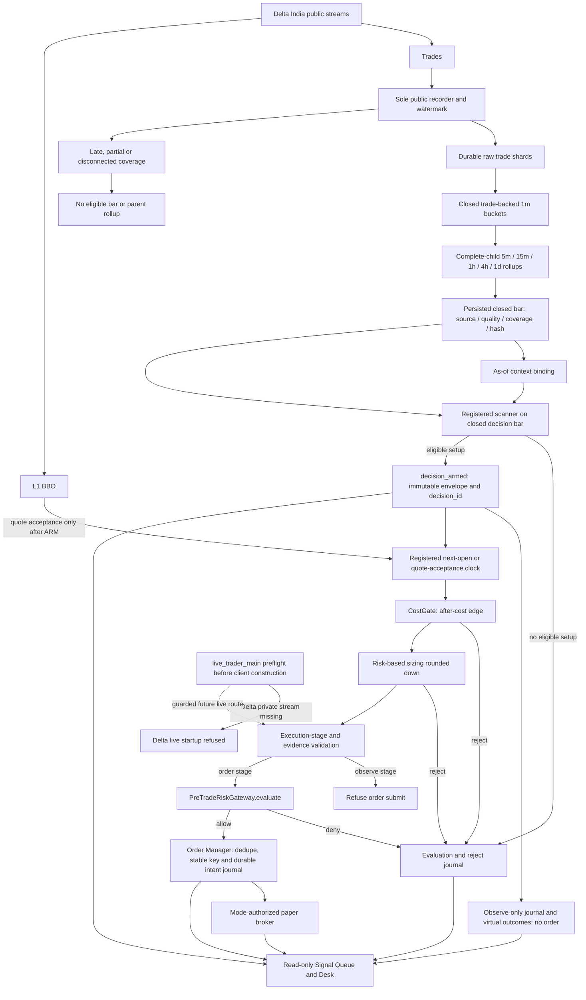

# VNEDGE Delta-to-decision and order path (projection contract v1)

This document describes the implemented path, not a new scanner claim or a
live-enable procedure. It does not alter any `strategy_id`, fire set, clock,
cost profile, roster, capital permission, or historical golden. The Signal
Queue is a recent, read-only journal projection and cannot authorize trading.

The dotted live edge is a future integration boundary, **not** a current
Delta execution route. The active observe-only lanes do not automatically
construct a sized candidate or run the gateway; an explicit
`evaluate_candidate()` can measure that gateway without submitting.

## Decision semantics

`lane_eval` records a scanner evaluation. No setup does not mint a
`decision_id`. A successful bar signal is bound by `bind_signal_decision()`;
the runtime writes `decision_armed` with the full `DecisionEnvelope`. ARM is
not a fill, an approved risk decision, or an order. The decision ID is derived
from the registered strategy and closed decision-bar identity, side, bound
snapshot, and entry clock. Quote acceptance adds BBO evidence after ARM; it
does not change the ARM identity.

The code does **not** currently expose a universal typed `FIRE` event. A
display must not infer one from `lane_eval.fired`, an ARM badge, or an order
acknowledgment. Actual order stages are proved by a matching envelope,
CostGate evidence, risk decision, persisted `order_intent`, and adapter/order
records. A complete fill chain is different from a completed trade or booked
strategy PnL.

The Signal Queue now indexes direct `decision_armed` envelopes and the
post-ARM `entry_quote_rejected` and `entry_route_rejected` events. It validates
the same envelope identity used for downstream execution records. A malformed
or contradictory ARM is an `identity_gap`, never a decision or fill.

## Entry and exit boundaries

The scanner does not size or contact the venue. The runtime checks an
executable quote and its registered route, then CostGate rejects missing or
insufficient edge evidence. `size_position()` rounds **down** to venue steps
and rejects an undersized order. The execution kernel refuses an observe-stage
submit and validates evidence before Order Manager submits. Every actual order
passes `PreTradeRiskGateway.evaluate()`; its full check list is journaled.
Order Manager can still refuse duplicate/unresolved risk or an unavailable
decision WAL before the adapter sees an intent. A failed live gate or risk
check never silently redirects an intended live order into shadow.
`OrderIntent` carries quantity and notional, but no idempotency-key field;
Order Manager assigns the stable client order ID to its managed order and
persists it before adapter submission.

The gateway's decision also depends on the frozen risk config, kill-switch
state, and evaluation time, not just the three intent/account/market snapshots.
It reports every failed check. Exchange health, public-data integrity and
freshness become warnings for reduce-only orders; invalid symbol, quantity,
order type, limit price or leverage still rejects. Entry-only checks cover
kill switch, account loss and drawdown limits, positions, streak, slippage,
spread and exposure. `APPROVED_WITH_WARNINGS` is explanation text, not a
separate decision enum. `OrderIntent` construction rejects zero quantity
before the gateway can evaluate it.

Reduce-only exits use the same guarded order spine. Public-feed health,
integrity, and freshness failures become warnings for exits, while invalid
order mechanics remain hard failures. Entry-only CostGate, spread, exposure,
and loss limits do not block a protective exit.

Observe-only candidates may deliberately call
`OrderManager.evaluate_candidate()` with a sized `OrderIntent` to measure the
same gateway, but observation records do not automatically traverse it and
cannot submit an order. Shadow virtual outcomes are research evidence, not
venue fills.

## Live boundary as implemented

`live_trader_main` is a separate, guarded CLI, not a default Compose service.
It refuses startup unless the live mode, enable flag, exact confirmation
phrase, pre-live checklist, capital-approved strategy, and trade credentials
all pass. The Delta adapter exists, but its native private order/fill stream
is still missing; Delta live startup is explicitly refused. The live session
also has a separate exchange-OHLC feed path, while registered production
scanners require canonical closed-bar evidence. Until that parity and private
truth are implemented and verified, "same fire, different sink" is an
architectural target, not a claim about a working Delta live route.

Research, replay, shadow, paper, and live evidence must remain partitioned by
`strategy_id`, symbol, entry clock, and cost profile. A changed claim, clock,
or fire-changing tariff requires a new registered ID and replay, not mutation
of a live strategy stream.
