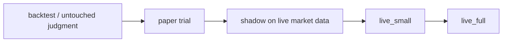

# Live Promotion Ladder

VNEDGE does not go live because a signal looks exciting. A lane advances one
rung at a time, with evidence attached at each step.

The code contract lives in `src/vnedge/runtime/live_ladder.py`.

## Rungs

| Target rung | Minimum evidence |
| --- | --- |
| `paper` | Frozen parameters, strategy/model registry entry, passed untouched-data judgment, explicit human approval. |
| `shadow` | Human approval after paper, at least 14 paper days, at least 10 paper trades, net-positive paper PnL, max paper drawdown <= 6%. |
| `live_small` | Human approval, cleared pre-live checklist, three live gates open, clean reconciliation, writable WAL, kill switch clear, at least 7 shadow days, at least 10 shadow trades, net-positive shadow result, shadow PF >= 1.05, max shadow drawdown <= 6%. |
| `live_full` | Human approval, cleared pre-live checklist, three live gates open, clean reconciliation, writable WAL, kill switch clear, at least 7 live_small days, at least 5 live_small trades, net-positive live_small result, max live_small drawdown <= 3%. |

These thresholds are intentionally conservative defaults. Changing them is a
reviewed code change or a pre-registered protocol change, not an operator mood
change during a drawdown.

## Non-Negotiables

- No rung skipping.
- Live modes still require the existing three gates:
  `trading_mode`, `live_trading_enabled=true`, and the exact confirmation
  phrase.
- `run_pre_live_checklist` remains mandatory before live. The ladder does not
  replace it; it feeds the "lower rungs validated" decision with concrete
  evidence.
- `emergency_reduce_only` is not a promotion rung. It exists only to reduce or
  flatten live exposure.
- A positive backtest, agent-council vote, scanner rank, TradingView-style
  signal, or UI badge is not live approval.

## Operator Pattern

1. Record the run reports and shadow outcome summaries for the lane.
2. Build a `LiveLadderEvidence` object from immutable reports.
3. Call `evaluate_live_ladder(evidence)`.
4. If blocked, fix the evidence gap. Do not override the ladder.
5. If allowed for a live rung, run the pre-live checklist again immediately
   before starting the live process.
