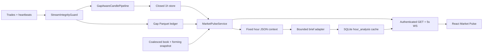

# Market Pulse

Market Pulse is VNEDGE's continuous, read-only hour-by-hour situation room. It
observes canonical closed candles and stream-integrity records; it cannot emit
signals, order intents, promotion decisions, or capital permission.



## Runtime contract

The canonical 1h Parquet store is the source for closed-hour OHLCV. The normal
dashboard `SnapshotProvider` may optionally expose current forming state:

```json
{
  "data_degraded": false,
  "price": {"bid": 64249.5, "ask": 64250.5, "mid": 64250.0},
  "pulse": {
    "forming": {
      "symbol": "BTCUSDT",
      "open": 64190.0,
      "high": 64310.0,
      "low": 64160.0,
      "close": 64250.0,
      "volume": 92.4
    }
  }
}
```

Forming state is displayed as in progress and is never persisted by the pulse
service. If the stream is degraded, the API reports `data_quality=degraded`.
Any closed hour overlapping a `GapRecord` is tagged `data_quality=gap` and is
never silently interpolated.

## Read-only API

- `GET /api/pulse/{symbol}?exchange=binanceusdm&n=48`
- `GET /api/pulse/{symbol}/hours?exchange=binanceusdm&n=48`
- `GET /api/pulse/{symbol}/hours/{open_time}/analysis?exchange=binanceusdm`
- `WS /api/pulse/stream?symbol=BTCUSDT&exchange=binanceusdm`

All routes use dashboard authentication. Browser clients first establish the
HttpOnly session cookie through `POST /auth/session`; no credential belongs in
the WebSocket URL. The stream sends a coalesced pulse every five seconds, not
individual trades. API payloads declare `read_only`,
`can_trade=false`, `can_promote=false`, and `live_orders_enabled=false`.

## Brief safety boundary

Each brief is keyed by exchange, symbol, and closed UTC hour in
`data/hour_analysis.sqlite`. An injected model adapter sees only:

- OHLC-derived bps metrics;
- trailing volume rank and median ratio;
- session VWAP distance;
- prior-hour range;
- AVWAP label, session flag, and explicit data quality.

The versioned `1.0` response contains the complete server-owned inputs snapshot,
five ordered sections (`state`, `what_mattered`, `structure`, `risks`,
`watch_next`), and server-derived quality/volume/range/VWAP flags. Section
lengths and allowed state labels are validated before persistence and again
when a cached record is loaded.

The words `buy`, `sell`, `long`, `short`, `enter`, `exit`, `target`, `stop`,
`leverage`, and `guaranteed` are forbidden in generated prose. Unprovided
numeric levels are also rejected. If quality is not `ok`, the server forces
`state.label=degraded_data`, requires the first risk to identify feed/gap
quality, and retains the measured gap minutes. Invalid or unavailable model
output is replaced by the deterministic five-section renderer.

Cache reuse requires the stored inputs to equal the current measurement
snapshot. Late gap evidence therefore invalidates an older clean brief. Every
brief displays `Observation only. Not financial advice. No order permission.`

## UI behavior

The React `/app` surface adds a Market Pulse tab with:

- a TradingView Lightweight Charts v5 canvas with closed 1h candles, session
  VWAP, an optional server-owned AVWAP price line, and an explicitly blue
  forming bar;
- UTC-only chart labels and whitespace points for absent hours, never synthetic
  zero-volume OHLC;
- forming-hour range, relative volume, VWAP/AVWAP context, and prior UTC-day
  trade-derived POC plus 70% value area;
- a horizontally scrollable UTC hour strip;
- click-to-lock cached analysis;
- hour-close and integrity notifications;
- explicit read-only and degraded-feed badges.

The desktop layout uses chart plus context rail. At mobile widths it stacks
chart, forming hour, brief, hour strip, and notifications without page-level
horizontal overflow.

The chart is a renderer only. All VWAP/AVWAP and Volume Profile values come
from the Python measurement layer. The prior-day profile reads exact public
trade shards, preferring the atomic Binance aggTrades archive for a completed
day and reporting its `source_exchange` instead of relabeling it as live tape.
It uses frozen fixed-price bins (BTC 10, ETH 1, SOL 0.1), and returns
unavailable when neither a complete archive nor gap-free live coverage exists.
The 70% contiguous area grows from POC toward the higher-volume adjacent bin;
an exact tie expands upward. Pulse reports target and realized volume share,
classifies exact VAH/VAL contact as `at_value_edge`, and atomically stores the
closed result under `data/volume_profiles` with a stable `window_id`. It never
distributes bar volume across an OHLC range. A history change uses `setData`;
ordinary forming-hour refreshes use the incremental `update` path. No chart
plugin may emit an order, signal, promotion decision, or capital permission.
