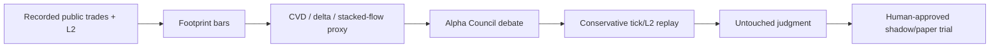

# Orderflow Footprint Miner

`vnedge.research.orderflow_footprint` is a research-only miner for public trade
flow. It reads the recorded tick lake, builds fixed-window footprint bars, and
publishes `research/live_research/orderflow_footprint_latest.json` for the
Alpha Council.

It does not trade, promote, or create shadow intents.

## What It Measures

- Buy/sell public trade volume and notional.
- Bar delta and cumulative volume delta (CVD).
- Top-of-book context when available: average spread, imbalance, and displayed
  top depth.
- A stacked-imbalance proxy: consecutive bars where signed public flow and
  price movement agree.

This is not proprietary footprint-by-price reconstruction. The recorder stores
public trades and top-of-book/depth snapshots, not a full exchange matching
engine queue. The miner therefore treats stacked imbalance as a hypothesis that
must be replayed, not as proof of execution edge.

## Artifact Contract

Every payload carries:

- `can_trade=false`
- `can_promote=false`
- `live_orders_enabled=false`
- `requires_conservative_replay=true`
- `requires_untouched_judgment=true`

Candidates are emitted with `route_decision=REPLAY_REQUIRED`. The Alpha Council
turns healthy candidates into `RUN_CONSERVATIVE_L2_REPLAY` workbench tasks, and
under-sampled candidates into `RECORD_MORE_TICKS`.

## Run Once

```bash
python -m vnedge.research.orderflow_footprint \
  --data-root data \
  --days latest \
  --bar-seconds 60 \
  --max-candidates 100 \
  --json
```

## Docker Service

`docker-compose.yml` runs `orderflow-footprint-miner` every 30 minutes by
default. It mounts the tick lake read-only and writes only to
`research/live_research`.

Useful environment knobs:

- `ORDERFLOW_FOOTPRINT_INTERVAL_SECONDS`
- `ORDERFLOW_FOOTPRINT_BAR_SECONDS`
- `ORDERFLOW_FOOTPRINT_MAX_CANDIDATES`
- `ORDERFLOW_FOOTPRINT_MIN_DELTA_RATIO`
- `ORDERFLOW_FOOTPRINT_MIN_PRICE_MOVE_BPS`

## Promotion Path



No candidate skips replay, judgment, human approval, or the normal gateway.
