# Scanner End-to-End Flows

Generated from deployed main `6ca324d`.

This document maps every current scanner family from data input to operator
output. It is intentionally conservative: scanners can observe, nominate, or
explain candidates, but they cannot trade or promote themselves.

## Safety Boundary

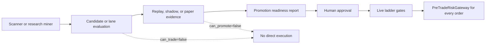

Hard rules:

- Runtime scanners are visibility surfaces only.
- Research miners produce hypotheses only.
- Conservative replay proves quote, fill, fee, and adverse selection behavior.
- Shadow and paper lanes collect operational evidence.
- Live requires the mode ladder, three live gates, pre-live checklist, and
  `PreTradeRiskGateway.evaluate()` on every order.

## Whole System Spine

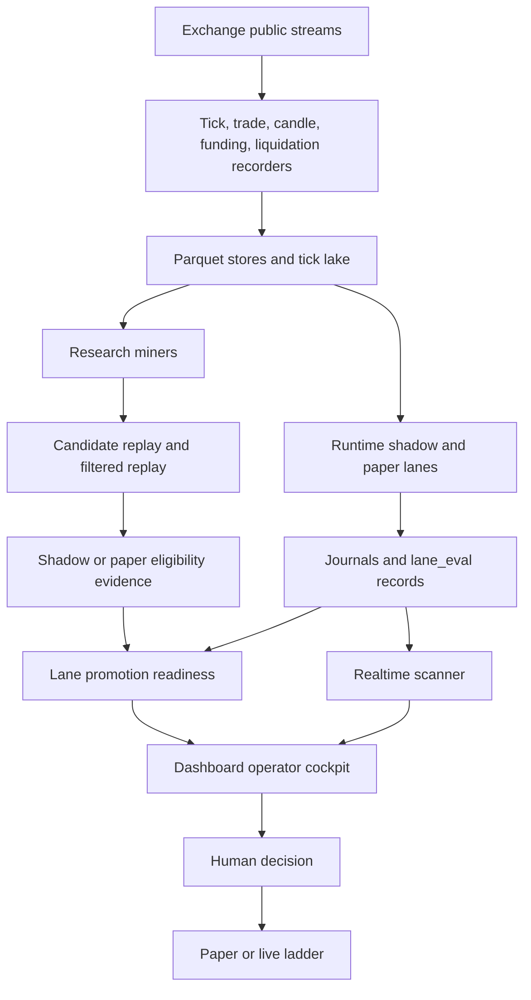

## Data Collection Lanes

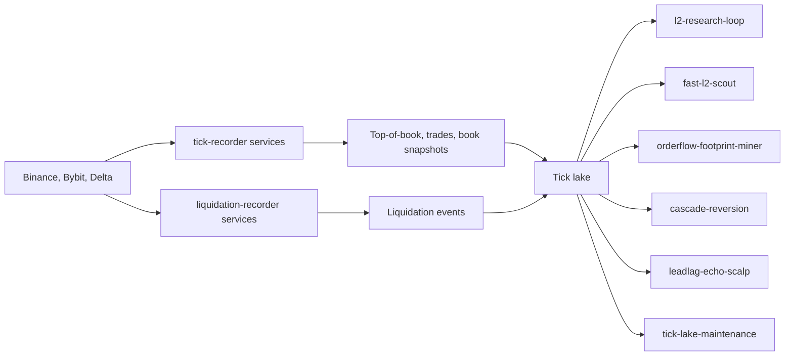

Outputs:

- Recorded public books and trades for conservative replay.
- Liquidation bursts for cascade/reversion research.
- Maintenance reports for disk pressure, compaction, and retention.

No orders, no promotion, no live-state mutation.

## Runtime Lane Scanner Spine

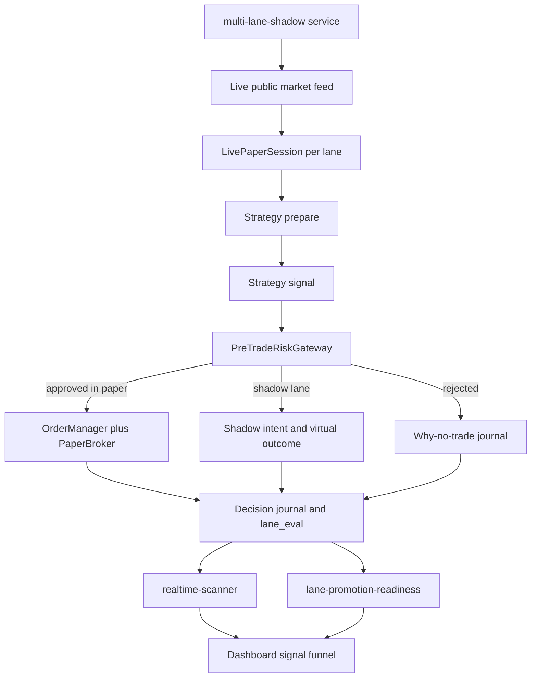

Runtime lane facts:

- `shadow` is live-data observation with no venue order.
- `paper` is simulated order flow through the same gateway and order manager.
- Paper observation mirrors can be enabled, but they are not governed paper
  trials and do not imply promotion.
- `realtime-scanner` reads live runtime journals only. It does not read replay
  artifacts and it cannot trade.

## Strategy Scanner Flows

### `funding_mean_reversion_v1`

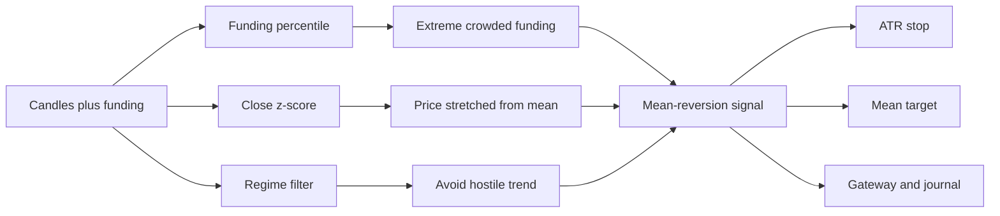

Purpose: sparse funding crowding reversals. This is not a high-frequency
scalper. It fires only when funding and price stretch align.

Common no-fire reasons: funding not extreme, z-score not stretched, hostile
trend, data freshness.

### `trend_continuation_v1`

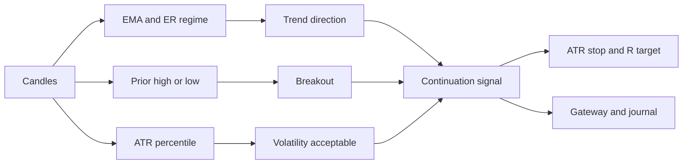

Purpose: joins breakouts in a confirmed trend.

Common no-fire reasons: no breakout, trend too weak, volatility too high, weak
funding filter.

### `volatility_expansion_breakout_v1`

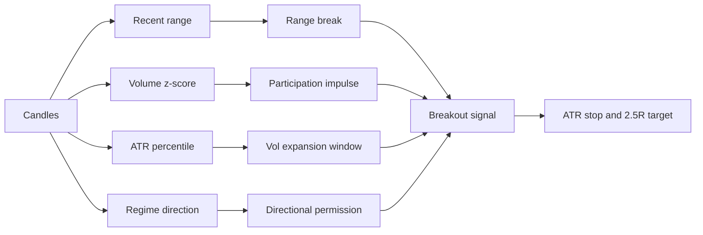

Purpose: expansion from compression or range boundary.

Common no-fire reasons: no participation impulse, volatility outside window,
breakout without regime permission.

### `panic_reversal_v1`

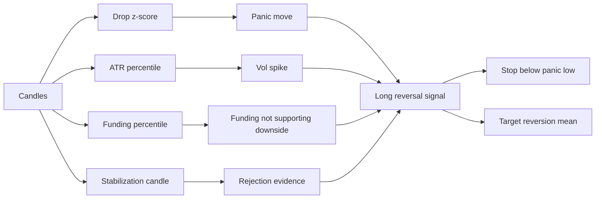

Purpose: rare-event long reversal after disorderly selloff.

Common no-fire reasons: panic events are rare, stabilization missing, reward to
mean target too small.

### `funding_squeeze_continuation_v1`

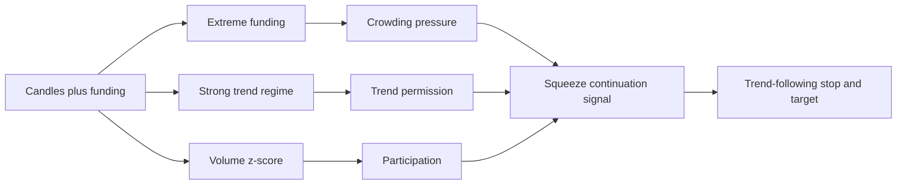

Purpose: joins the trend when crowded funding keeps squeezing rather than
fading it.

Common no-fire reasons: funding is extreme but trend is not strong, or trend is
strong without participation.

### `alpha_stack_confluence_v1`

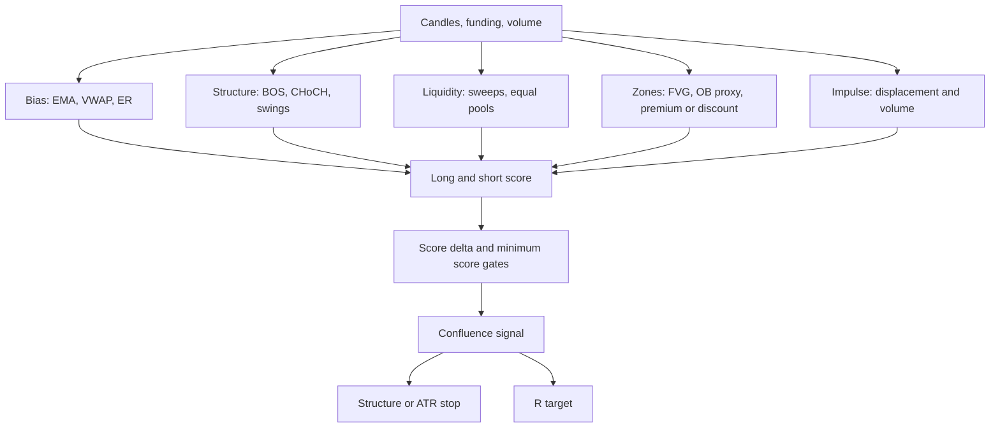

Purpose: causal confluence stack inspired by discretionary SMC concepts, but
implemented as explicit feature gates.

Common no-fire reasons: side separation too low, score below threshold,
missing displacement, missing sweep or zone confirmation.

### `quant_signal_pack_v1`

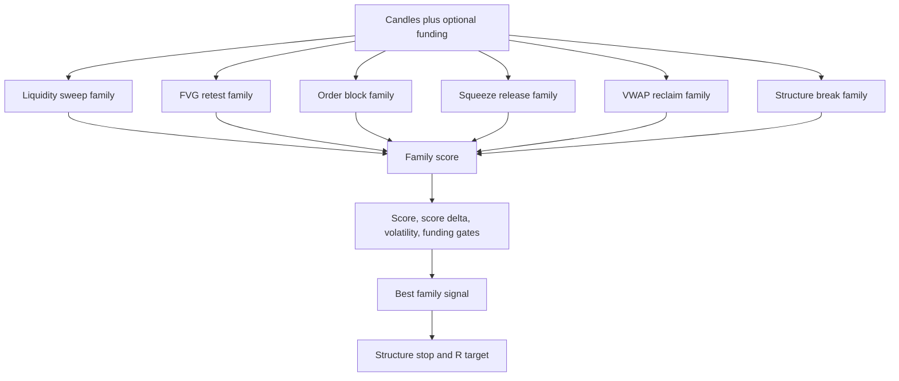

Purpose: multi-family scanner for candle-level technical setups.

Common no-fire reasons: no family reaches threshold, long and short scores are
too close, setup exists but trigger candle is weak.

### `sats_5m_scalper_v1`

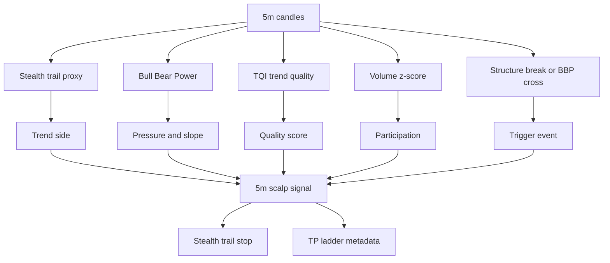

Purpose: TradingView-style 5m scalp scanner using causal BBP, trend quality,
trail, and trigger events.

Common no-fire reasons: BBP pressure weak, quality strength low, no trigger
event, participation too low.

### `stealth_trail_bbp_v1` and `human_trade_fingerprint_v1`

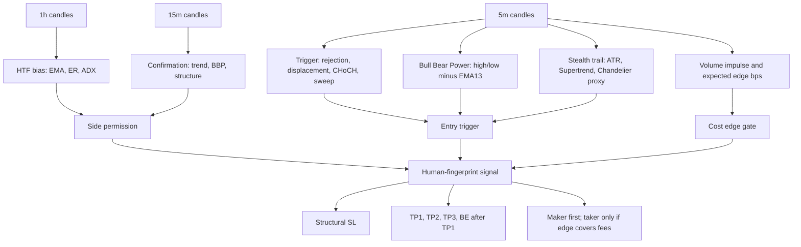

Purpose: encode the user's discretionary 5m chart model: 1h bias, 15m
confirmation, 5m trigger, BBP, stealth trail, displacement, and structure.

Promotion threshold: expected net edge greater than 25 bps, PF greater than
1.5, and at least 20 historical trades. Taker fallback is allowed only when
expected move covers fees, slippage, and safety buffer.

Common no-fire reasons: HTF and trigger disagree, displacement is too small,
volume impulse is weak, expected net edge is below the fee wall.

### `smc_playbook_scalper_v1`

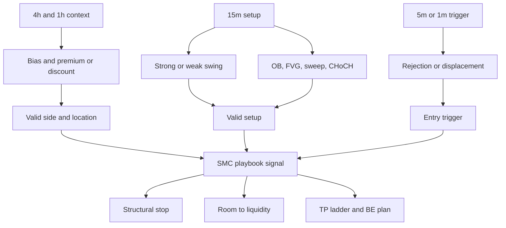

Purpose: explicit version of the discretionary pattern: HTF bias, premium or
discount, liquidity, OB/FVG, sweep, CHoCH, rejection/displacement, and a
structured trade plan.

Common no-fire reasons: setup zone exists but trigger is absent, trigger exists
in a poor location, room to liquidity is not enough after fees.

### `trend_retest_v1`

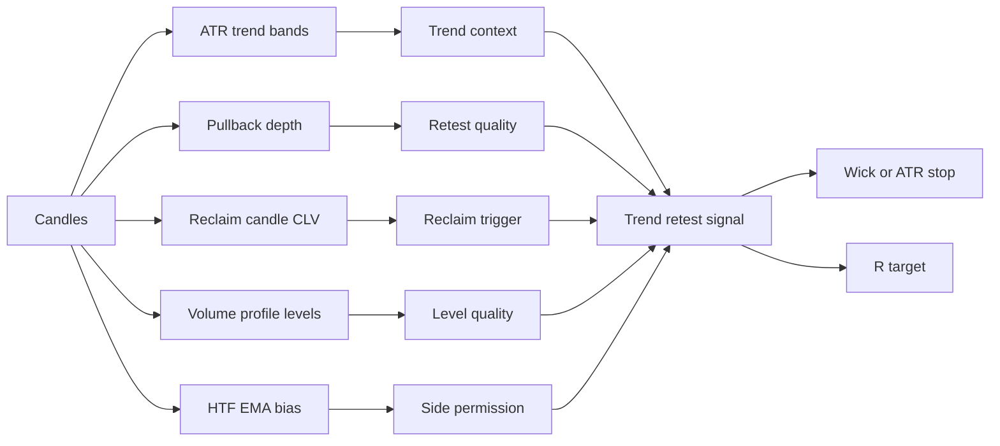

Purpose: enters pullback/retest instead of raw breakout.

Common no-fire reasons: retest not deep enough, reclaim weak, chop filter,
HTF bias not aligned.

### `alpha_distillation_pack_v1`

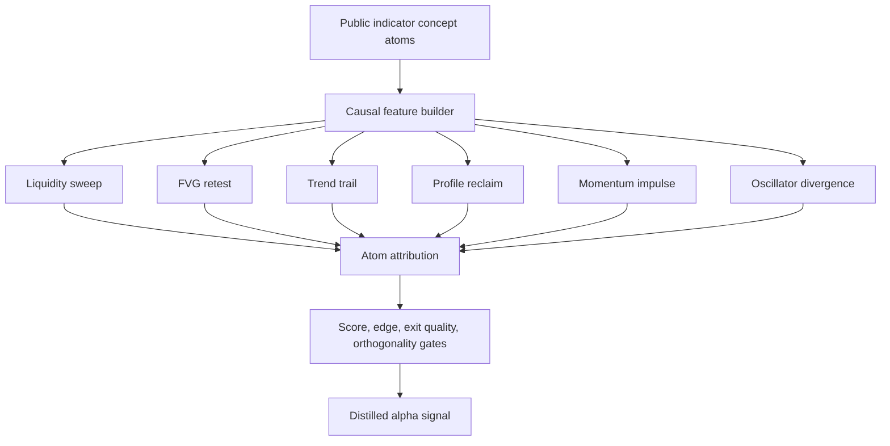

Purpose: adapt external indicator ideas into causal, testable VNEDGE atoms
without copying proprietary scripts.

Common no-fire reasons: atom score too weak, edge bps below threshold, exit
quality poor, single-atom overfit risk.

### `daily_scalper_pack`

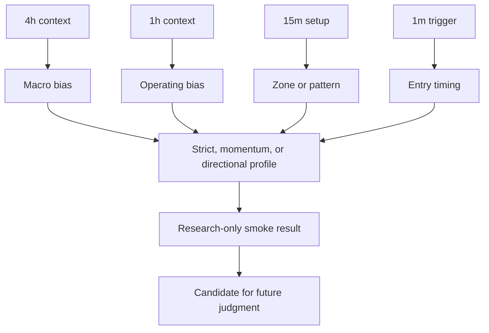

Purpose: research scanner for daily scalping cadence using 4h, 1h, 15m, and
1m. It is not a live execution service.

Common no-fire reasons: strict profile under-trades, 1m trigger not aligned
with 15m setup, more trades lower expectancy.

## Research Miner Flows

### `research-loop`

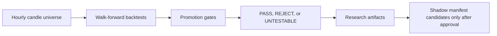

Purpose: broad candle research across symbols, venues, and strategy families.

### `l2-research-loop` and `l2-fast-scout`

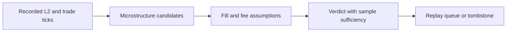

Purpose: discover microstructure edges without risking capital.

### `orderflow-footprint-miner`

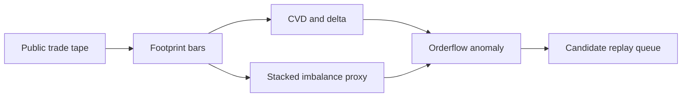

Purpose: nominate orderflow anomalies. It does not issue trade signals.

### `event-leadlag-miner`

```mermaid
flowchart LR
    A["1m lanes across venues"] --> B["Leader shock detection"]
    B --> C["Follower lag check"]
    C --> D["After-cost horizon score"]
    D --> E["Lead-lag candidate"]
    E --> F["Replay or shadow observation"]
```

Purpose: identify cross-venue leader/follower moves such as Delta following
Binance or Bybit.

### `cascade-reversion`

```mermaid
flowchart LR
    A["Liquidation events"] --> B["One-sided burst detector"]
    B --> C["Exhaustion and quiet window"]
    C --> D["Opposite-side reversion hypothesis"]
    D --> E["Maker-first and taker-taker outcome report"]
```

Purpose: test liquidation cascade reversion.

### `leadlag-echo-scalp`

```mermaid
flowchart LR
    A["Leader trades and follower books"] --> B["Lag estimator"]
    B --> C["Echo entry model"]
    C --> D["Conservative fill model"]
    D --> E["Net edge verdict"]
```

Purpose: tick-level cross-venue echo scalping research.

### `alpha-distillation`

```mermaid
flowchart LR
    A["Public indicator patterns"] --> B["Causal atoms"]
    B --> C["Walk-forward test"]
    C --> D["Atom attribution"]
    D --> E["Workbench escalation if robust"]
```

Purpose: turn public visual indicator ideas into causal, testable features.

### `bitcoin-regime-sensor`

```mermaid
flowchart LR
    A["BTC market context"] --> B["Regime features"]
    B --> C["Context artifact"]
    C --> D["Council and dashboard context"]
```

Purpose: context only. It is not a trade signal.

## Execution Proof Flows

### `candidate-replay-executor`

```mermaid
flowchart LR
    A["Lead-lag or orderflow candidate"] --> B["Passive quote simulation"]
    B --> C["Trade-through fill check"]
    C --> D["Taker exit model"]
    D --> E["Fees, slippage, adverse selection"]
    E --> F["Replay verdict"]
```

Purpose: answer whether a candidate survives realistic execution.

### `execution-condition-miner`

```mermaid
flowchart LR
    A["Replay failures"] --> B["Failure bucket"]
    B --> C["Data gap, no quote, no fill, fee wall, queue risk"]
    C --> D["Fresh filter proposal"]
```

Purpose: explain why replay failed and propose filters that must be tested on
fresh windows.

### `filtered-replay-executor`

```mermaid
flowchart LR
    A["Filter proposal"] --> B["Unseen replay window check"]
    B --> C["Causal pre-entry filter"]
    C --> D["Fresh replay verdict"]
    D --> E["Shadow manifest only if positive"]
```

Purpose: validate proposed fixes without reusing burned data.

### `event-leadlag-shadow`

```mermaid
flowchart LR
    A["Live 1m leader/follower data"] --> B["Selected lead-lag specs"]
    B --> C["Eligibility check"]
    C --> D["Shadow intent or why-no-trade"]
    D --> E["Live observation journal"]
```

Purpose: live-data observation of selected lead-lag candidates. No orders.

### `realtime-shadow-scalp`

```mermaid
flowchart LR
    A["Live tick stream"] --> B["Cascade and echo families"]
    B --> C["Virtual entry and exit"]
    C --> D["Fee-wall decomposition"]
    D --> E["Shadow scalp artifact"]
```

Purpose: tick-level virtual scalping with explicit gross move, fees, and
slippage decomposition.

## Governance and UI Flows

### `realtime-scanner`

```mermaid
flowchart LR
    A["Runtime journals"] --> B["Latest lane_eval"]
    A --> C["Shadow intents"]
    A --> D["Paper orders"]
    B --> E["State: FIRING, NEAR_TRIGGER, WAITING, WARMING, STALE, NO_EVAL"]
    C --> E
    D --> E
    E --> F["Gate diagnostics and uplift action"]
    F --> G["Dashboard signal funnel"]
```

Purpose: tell the operator what is forming now and why lanes are not firing.

### `lane-promotion-readiness`

```mermaid
flowchart LR
    A["Manifest lanes"] --> B["Replay evidence"]
    C["Shadow or paper evidence"] --> D["Readiness classifier"]
    B --> D
    D --> E["PAPER_REVIEW_READY, SHADOW_COLLECTING, SHADOW_NEGATIVE, PAPER_ACTIVE"]
    E --> F["Dashboard ladder"]
```

Purpose: truth table for paper/shadow/live readiness. It never grants live by
itself.

### `alpha-council`

```mermaid
flowchart LR
    A["Research artifacts"] --> B["Agent review and debate"]
    B --> C["Ranked next actions"]
    C --> D["Workbench or research queue"]
```

Purpose: prioritize research work. It cannot trade or promote.

### `alpha-workbench`

```mermaid
flowchart LR
    A["Research task"] --> B["Durable proof packet"]
    B --> C["Evidence checklist"]
    C --> D["Candidate, reject, or needs data"]
```

Purpose: keep proof tasks auditable and repeatable.

### `vibe-intelligence`

```mermaid
flowchart LR
    A["Hypotheses and outcomes"] --> B["Lifecycle memory"]
    B --> C["Avoid repeated dead ends"]
    C --> D["Council context"]
```

Purpose: remember what was tried, what failed, and what needs fresh data.

### `agent-job-runner`

```mermaid
flowchart LR
    A["Agent Gateway job"] --> B["Research-only worker"]
    B --> C["No credentials, no orders"]
    C --> D["Artifacts for review"]
```

Purpose: AI research interface with no execution authority.

## Promotion Ladder

```mermaid
flowchart TB
    A["Research PASS"] --> B["Pre-registered untouched judgment"]
    B --> C["Replay positive if execution-sensitive"]
    C --> D["Shadow observation"]
    D --> E["Paper trial"]
    E --> F["Pre-live checklist"]
    F --> G["live_small"]
    G --> H["live_full"]

    A -. "not enough" .-> X["No direct promotion"]
    D -. "not enough" .-> X
    E -. "requires human approval" .-> X
```

Promotion is evidence-driven, not signal-count-driven. A lane that fires often
but loses after costs should be refactored or tombstoned, not promoted.

## Operator Lookup Table

| Symptom | Inspect first | Likely meaning |
|---|---|---|
| No lanes firing | `realtime-scanner` gate diagnostics | Market is not meeting live gates, or telemetry is stale |
| Many `WAITING` lanes | Primary blocker and `uplift.action` | Most lanes are missing side separation, participation, impulse, or cost edge |
| Negative shadow trades | `lane-promotion-readiness` triage | Entry/exit quality failed in live observation |
| Replay positive but no paper | Readiness blockers | Needs shadow adapter, paper approval, or enough live outcomes |
| Paper active but no trades | Paper lane journal and realtime scanner | Strategy is enabled but setup has not appeared |
| Stale lanes | Lane health auditor and feed freshness | Data/service issue, not a market verdict |
| Candidate rejected after replay | Replay failure bucket | No fill, fee wall, queue risk, adverse selection, or data gap |
| UI says ready but ladder blocks | `/lane-readiness` report | Dashboard must follow readiness truth, not visual inference |

## Practical Reading

For scalping, the bot currently has three distinct classes:

1. Candle scalpers: `sats_5m_scalper_v1`, `stealth_trail_bbp_v1`,
   `human_trade_fingerprint_v1`, `smc_playbook_scalper_v1`,
   `daily_scalper_pack`.
2. Microstructure scalpers: `leadlag_echo_scalp`, `cascade_reversion`,
   `event-leadlag-shadow`, `realtime-shadow-scalp`.
3. Governance scanners: `realtime-scanner`, `lane-promotion-readiness`,
   `execution-condition-miner`, `filtered-replay-executor`.

If a scanner is not firing, the next fix is not "promote everything". The next
fix is to read the nearest failed gate, decide whether it is a market absence,
data absence, over-tight threshold, or true negative edge, then test any change
on fresh data before paper or live exposure.
